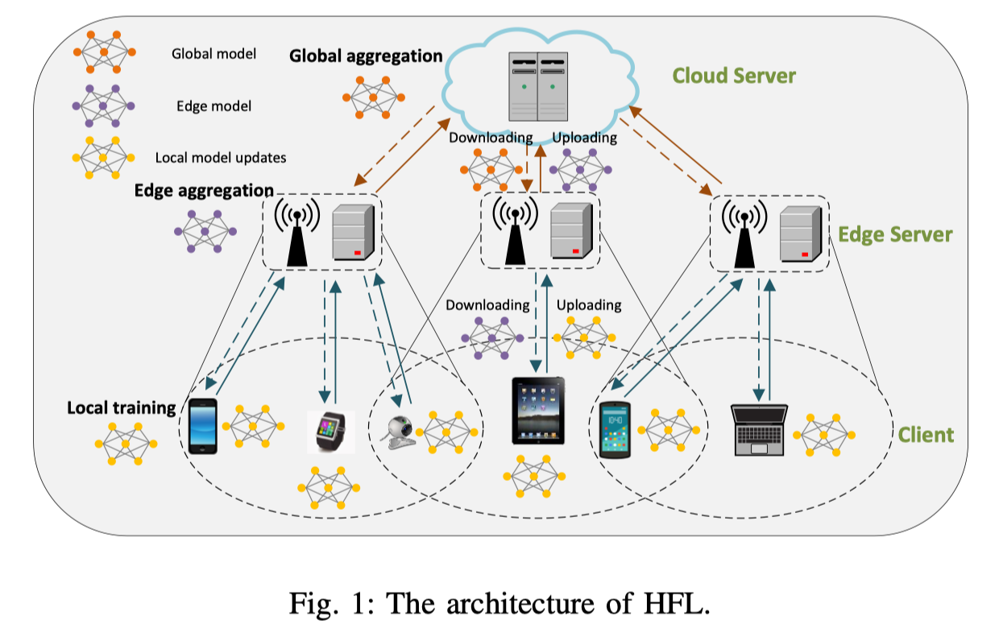
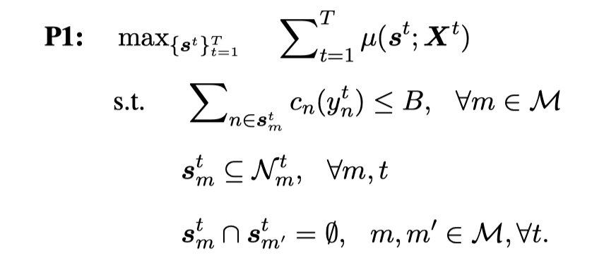
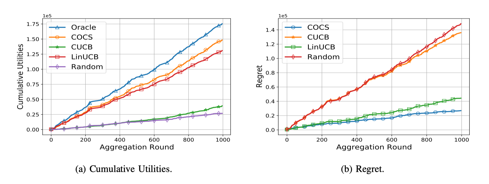

# Context-Aware Online Client Selection for Hierarchical Federated Learning

本文主要研究了客户端的选择问题。即每一轮尽可能多地选择客户，并且在每个客户端预算有限的情况下。提出了一种COCS策略，该算法观察客户端本地计算和传输的辅助信息，作出客户端的决策，以在有限预算的情况下最大化网络运营商的效用。

## 先验知识

MAB问题：也是称为赌徒老虎机问题，假设一个用户对不同的类别感兴趣，，当系统初见这个用户时候，如何快速知道他对哪个类别感兴趣。

## Introduction

FL瓶颈：客户端传递时延，掉队效应。

本文改进方式：通过选择客户端，改进FL性能和通信开销。

背景：传统HFL对掉队者现象没有明确解决。选择客户端也并不简单，因为其面临着几个挑战：

1、边缘ES比云服务器CS受到更多的限制，每个ES的**可访问客户端都是时变**的，网络运营商(NO)必须在重叠区域仔细选择客户端到相应的ES。

2、由于HFL网络的优点是能够处理离散者问题，因此如何设计一个高效的**客户选择策略**比传统的FL网络更加重要。

本文主要研究了HFL的客户选择问题，提出一种名为COCS的基于学习的策略。该算法基于MAB框架开发。通过获取客户端的**计算信息**，如计算资源、客户-边缘传输信息、带宽和距离等。

贡献：

1、定义了一个客户选择问题，网络运营商在有限预算下选择客户端。客户端决策有三个问题：（1）估算ESs在冷启动时成功接收到的本地模型更新。（2）判断由于连接条件时变，客户端是否应该被选择到某一ES。（3）有限资源下最大化效率。

2、客户端选择问题被定义为一种CC-MAB问题，开发了一种名为**上下连接感知的在线客户端选择算法（COCS）**。

3、假设客户端信息被网络运营商全部已知，则客户端选择可以归纳为$M$个背包和一个拟阵约束的子模块最大化问题。并用了快速懒惰贪婪算法（FLGreedy）逼近最优解。

## 系统模型和问题描述

### A、分层FL初步研究

系统定义：客户端$\mathcal{N}=\{1,2,...,N\}$和边缘端ES$\mathcal{M}=\{1,2,...,M\}$以及一个云聚合器构成。用$\mathcal{N}^t_m=\{1,2,...,N^t_m\}$表示在时间步$t$可以与ES$m$进行聚合的客户端集合。允许存在重合部分，但同一个客户端只能与一个ES通信。设$w^*$是最优模型，则HFL是使平均损失函数最小化：
$$
\min _{\boldsymbol{w}} f(\boldsymbol{w}):=\frac{1}{M} \sum_{m \in \mathcal{M}} \frac{1}{S_{m}} \sum_{n \in \boldsymbol{s}_{m}} F_{n}(\boldsymbol{w})
$$
其中$\boldsymbol{s}_{m}$是ES$m$选中的客户端集合，数量为$S_m$，$F_{n}(\boldsymbol{w})=\sum_{\xi_{n} \sim \mathcal{D}_{n}} \ell\left(\boldsymbol{w} ; \xi_{n}\right)$，表示在数据集$\mathcal{D}_n$上的训练损失函数。损失函数可以是凸的也可以是非凸的。

HFL的训练步骤为：

1、每个ES$m$选择子集$s_m^t\subseteq \mathcal{N}_m^t$，被选中的客户端ES$m$下载模型$w_m^t$并将其设置为本地模型$w_n^t=w_m^t$。

2、本地客户端训练自己的梯度下降：
$$
\boldsymbol{w}_{n}^{t+e+1}=\boldsymbol{w}_{n}^{t+e}-\eta_{t} g\left(\boldsymbol{w}_{n}^{t+e} ; \xi_{n}^{t+e}\right)
$$
$e$为从0到$E-1$的轮次。

3、经过$E$轮学习后，本地模型将$\Delta_{n}^{t} \triangleq \boldsymbol{w}_{n}^{t+E-1}-\boldsymbol{w}_{n}^{t}$传递给边缘：
$$
\boldsymbol{w}_{m}^{t+1}=\boldsymbol{w}_{m}^{t}+\frac{1}{S_{m}^{t}} \sum_{n \in \boldsymbol{s}_{m}^{t}} \Delta_{n}^{t}
$$
4、每$T$轮边缘聚合后，进行一次全局聚合，云端得到$w^t=\frac{1}{M}\sum _{m=1}^Mw_m^t$，再将该模型下发给边缘。

### B、客户选择成本

每个边缘聚合开始的时候，每个客户端都会显示其可计算资源$y_n^t$，包括当前轮次t的CPU频率、RAM和存储空间。NO向客户端提供$c_n(y_n^t)$，其中该函数是一个非减函数。设NO设置的界限为$\tilde{B}$，则需保证$\sum_{m \in \mathcal{M}} \sum_{n \in \boldsymbol{s}_{m}^{t}} c_{n}\left(y_{n}^{t}\right) \leq \tilde{B}$。

### C、HFL的限制

边缘聚合包括四个阶段：下载传输(DT)、本地计算(LC)、上传传输(UT)和边缘计算(EC)。

DT阶段，通过下公式计算信道状态：
$$
c_{\mathrm{DT}, n}^{t}=\log _{2}\left(1+P_{n}^{t} g_{\mathrm{DT}, n}^{t} / N_{0}\right)
$$
其中$P_n^t$是传输功率，$g_{\mathrm{DT}, n}^{t}$是下行信道功率，$N_0$是噪声功率，设$a_{DT}$是下载模型的大小，分配的带宽是$b_n^t$，这样，对于客户端$n$其DT时间是$\tau_{\mathrm{DT}, n}^{t}=a_{\mathrm{DT}} /\left(b_{n}^{t} c_{\mathrm{DT}, n}^{t}\right)$。

LC时间取决于计算资源$y_n^t$，其时间为$\tau_{\mathrm{DT}, n}^{t}(y_n^t)=q/y_n^t$。

UT时间和DT时间类似：$\tau_{\mathrm{UT}, n}^{t}=a_{\mathrm{UT}} /\left(b_{n}^{t} c_{\mathrm{UT}, n}^{t}\right)$。

边缘计算时间EC为$\tau_{\mathrm{EC}, m}^{t}=q_m/y_m$，其中$q_m$是边缘模型的工作量，$y_m$是ES的处理能力。

所以总时间可以写为：
$$
\begin{aligned}
\tau_{n}^{t}\left(y_{n}^{t}\right) &=\tau_{\mathrm{DT}, n}^{t}+\tau_{\mathrm{LC}, n}^{t}\left(y_{n}^{t}\right)+\tau_{\mathrm{UT}, n}^{t}=\frac{a_{\mathrm{DT}, n}^{t}}{b_{n}^{t} c_{\mathrm{DT}, n}^{t}}+\frac{q}{y_{n}^{t}}+\frac{a_{\mathrm{UT}, n}^{t}}{b_{n}^{t} c_{\mathrm{UT}, n}^{t}}, \quad \forall n, t
\end{aligned}
$$
对于掉队者，基于最后期限的FL更有效果，即将$\tau_n^t>\tau_{dead,m}$的客户端直接丢弃。因此边缘聚合重新描述为：

其中$X_n^t$表示一个二进制变量，如果$\tau_n^t<\tau_{dead,m}$，$X_n^t=1$，$\tau^Z$为最快的第$Z$个客户端。总之一定要有$Z$个设备进行聚合。

### D、HFL的客户端的有效函数

已有的论证：强凸或者非凸的HFL，只要客户端足够多就足够容易收敛。

如图为$M=3,N=5$的情况：

因为存在掉队效应，所以被选中的客户端不一定达到EC阶段，即$\sum_{n\in s_m^t}X_n^t<=S_m^t$，**为了达到有针对性的收敛标准，NO因此需要运行更多的FL轮**。

令$X_m^t=\{X_{n.m}^t\}_{\forall n\in \mathcal{N}_m^t}$，那么在ES$m$上的决策效用表示为：
$$
\mu\left(\boldsymbol{s}_{m}^{t} ; \boldsymbol{X}_{m}^{t}\right)=\sum_{n \in \boldsymbol{s}_{m}^{t}} X_{n, m}^{t}
$$
所以整个网络的效用函数定义为：
$$
\mu\left(\boldsymbol{s}^{t} ; \boldsymbol{X}^{t}\right)=\frac{1}{M} \sum_{n\in \mathcal{M}} \sum_{n \in \boldsymbol{s}_{m}^{t}} X_{n, m}^{t}
$$

### E、客户选择问题的制定

NO客户选择问题是一个序列决策问题。NO的目标是做出选择决策$s^t$使得T轮次后效用最大化，我们设定NO对ES平均分配预算，即对于每个$m$，$B=\tilde{B}/M$，那么客户端选择问题可以写为：

难点：

1、NO对于前几轮选择的客户没有足够的经验，需要依赖收集历史数据进行评估

2、如何在有限的预算下优化每个ES的选择决策需要仔细考虑

3、s.t.2说明ES选择时变，s.t.3说明只能有一个客户端被选中。

## 基于文本感知的客户端选取

能否成功地参与到相应的ES中**取决于多方面的因素，这些因素被称为环境（context）**。本文根据环境决定选择的客户端。

客户端与ES连接的概率取决于$r_{DT}^t,y_n^t,r_{UT}^t$（总时间计算公式），其中$r_{DT}^t,y_n^t$已知，另外一个可以通过$r_{DT}^t$推断出来，所以用这两个作为环境进行推导。

设$\phi_{n,m}^t\in \Phi$表示在$t$轮次连接配对的环境，则所有信息集合在$\phi^{t}=\left\{\phi_{n, m}^{t}\right\}_{\forall m, n \in \mathcal{N}_{m}^{t}}$上，客户端$n$与$m$是否连接成功是一个由$\phi_{n,m}^t$参数化的随机变量，定义为$X_{n,m}^t(\phi_{n,m}^t)$。设$p_{n,m}(\phi_{n,m}^t)=E[X_{n,m}(\phi_{n,m}^t)]$为$X_{n,m}(\phi_{n,m}^t)$的期望。

### A、Oracle解决方案和遗憾

Oracle作为benchmark，假设NO知道成功参与的概率$p_{n,m}^t(\phi_{n,m}^t)\forall m,n\in \mathcal{N}_m^t$。所以效用函数$\mu(s^t,p^t)$NO完全知道，所以我们可以得到用户选择的最优值。长期选择问题可以优化为：

这是一个组合优化问题，NO需要选择一个合适的用户决策方案来优化所有ES的参与概率，背包约束来自s.t.1。所以上述问题是一个NP难问题。

我们定义了最优的序列$s^{opt,t}$在实际操作中，参与者的先验知识是不可知的，因此在每一轮边聚合中，NO必须基于估计的参与者$\widehat{X}^t$做出选择决策st。直观地说，NO应该设计一个在线客户选择策略，根据估计的$\widehat{X}^t$来选择$s^t$，假设有一组选择序列$\{s^1,s^2,...,s^T\}$，则预期的遗憾是：
$$
\mathbb{E}[R(T)]=\sum_{t=1}^{T}\left(\mathbb{E}\left[\mu\left(\boldsymbol{s}^{\mathrm{opt}, t} ; \boldsymbol{X}^{t}\right)\right]-\mathbb{E}\left[\mu\left(\boldsymbol{s}^{t} ; \boldsymbol{X}^{t}\right)\right]\right)
$$

### B、环境感知的在线客户端选择策略

在边缘聚合轮次$t$中，NO的COCS执行如下：

1、NO观察所有的连接对$\phi^t=\{\phi_{n,m}^t\}_{n,m}\in \mathcal{N}_m^t$。

2、NO基于当前轮$t$中，观察到的环境信息$\phi^t$和前$t-1$轮学习到的知识确定选择决策$s^t$。

3、如果$s_n^t\neq0,\forall n\in s_m^t$，位于ES$m$覆盖区域内的客户端可以由ES$m$选择用于$T$轮训练。

4、模型更新$\Delta_n^t$，然后根据连接对情况的$\phi_{n,m}^t$更新估计的参与情况$\widehat{X}_{n,m}(\phi_{n,m}^t)$。

整个COCS算法需要2个参数$K(t)$和$h_T$需要设计，$K(t)$是一个单调递增的确定性函数，用于识别未开发的环境，$h_T$用来确定如何划分环境空间。

**初始化阶段：**

给定参数$h_T$，首先创建一个由$\mathcal{L}_T$表示的分区，其将$\Phi=[0,1]^2$分为$(h_T)^2$个集合。其中$l\in \mathcal{L}_T$，计数器$C_{n,m}^t(l)$记录事件$V_{n,m,l}$发生的次数：$n$被$m$选中并且成功在$\tau_{dead}$时间内运行，ES$m$也要记录经验值$\mathcal{E}_{n,m}^t(l)$，其中包含了事件发生时观察到的指标，则选择估计的概率为：
$$
\hat{p}_{n, m}^{t}(l)=\frac{1}{C_{n, m}^{t}(l)} \sum_{X \in \mathcal{E}_{n, m}^{t}(l)} X
$$
**超立方体鉴定阶段：**

如果客户端$n$的模型可以成功上传，则我们得到$l_{n,m}^t$为$\phi_{n,m}^t$的超立方体，客户端$n$与$m$相连接的概率是$\widehat{X}_{n,m}^t=\widehat{p}_{n,m}^t(l_{n,m}^t)$。为了充分探索连接的可能性，定义未充分探索的连接：
$$
\mathcal{L}_{m}^{\mathrm{ue}, t} \triangleq\left\{l \in \mathcal{L}_{T} \mid \begin{array}{l}
\exists \phi_{n, m}^{t} \in \phi^{t}, \phi_{n, m}^{t} \in l, \tau_{n}^{t} \leq \tau_{\text {dead }} \\
\text { and } C_{n, m}^{t}(l) \leq K(t)
\end{array}\right\}
$$
同时定义$\mathcal{N}_{m}^{\mathrm{ue}, t}\left(\boldsymbol{\phi}^{t}\right) \triangleq\left\{n \in \mathcal{N}_{m}^{t} \mid l_{n, m}^{t} \in \mathcal{L}_{m}^{\mathrm{ue}, t}\left(\boldsymbol{\phi}^{t}\right)\right\}$表示未充分探索的$n$的集合。

我们定义如何决定客户端的准确度为**开拓**。定义对于某个超立方体需要收集更多训练结果为**探险**。

**探险阶段：**

如果$m$存在未充分探索的客户端，则进行探险，探险阶段分为2部分：

1、所有的ES都未充分开发，则COCS的目的是尽可能多的选择未开发的客户端，通过以下优化：

这里面的绝对值只选择的规模。

2、部分ES有未被开发的客户端，我们将这个分为2个阶段，NO首先通过解决以下问题来选择拥有未被开发客户端的ES：

其中$\widetilde{s}^t$为在拥有未完全开发的客户端的ES的决策，接着探索已经开发的客户端：

如果能够保证$B-\sum_{n \in \tilde{s}_{m}^{t}} c_{n}\left(y_{n}^{t}\right) \geq c^{\min , t}, m \in \mathcal{M}$并且$c^{min,t}=\min _{n \in \mathcal{N}_{m}^{\mathrm{ed}, t}} c_{n}\left(y_{n}^{t}\right)$，则客户端的选择遵循：

如果不是的话，则NO没必要在这里面继续选择客户端，因为没有多余的预算，只需要进行联合优化：

**开拓阶段：**

如果未开发的客户端集合是空集，则最优策略通过求解P2得到。

**更新阶段：**

在每一轮选完配对后，COCS观察模型更新是否能在$\tau_{dead}$之前收到，更新$\widehat{p}_{n,m}^t(l)$和$C_{n,m}^t(l)$。

## 实验

环境设定：客户端的带宽、计算能力、通信距离按照均匀分布采样。

