# SHARE: Shaping Data Distribution at Edge for Communication-Efficient Hierarchical Federated Learning学习笔记

[toc]

## Abstract

- 问题提出：

当下一个重要的挑战是**提交模型更新的通信开销**，因为通常需要频繁的云模型聚合才能达到目标精度，特别是当移动节点上的**数据分布不平衡**时。

- 问题解决：

通过在边缘中进行模型聚合，可以避免频繁的云模型聚合。为此提出了分层联邦学习框架（HFL），该框架选择**分布式节点的子集作为边缘聚合器**来进行边缘聚合。

- 其他：

在该框架下，建立了一个通信成本最小化（CCM）问题，通过对边缘聚合器的选择和分布式节点关联的决策来最小化边/云聚合带来的通信成本。

HFL的潜力在于边缘聚合器的数据分布，受此启发，我们提出了SHARE（题目缩写），将原问题化为2个子问题：最小化每轮通信成本和平均边缘聚合器的KL散度，并分别设计了2种轻量级算法进行求解。

---

## 1 INTRODUCTION

由于不能获取用户隐私数据，由此传统FL实现与缺陷。（通信开销、非独立同分布的数据）

目前常见的方法：1、对模型压缩，以减小每轮通信消息的大小；2、减少云聚合轮数。

本文的方式：利用**边缘聚合**的效能，避免频繁的云聚合而不降低学习性能，这是节省通信成本的一个新方向，可以与上述方法相结合，共同提高通信效率。

这启发了我们研究层次联合学习(HFL)框架，在该框架中，**分布式节点的子集可以被选择为边缘聚合器**，以低通信成本与附近节点进行边缘模型聚合。经过几轮边缘聚合后，边缘聚合器将边缘模型更新提交到云以进行全局聚合。

但HFL的潜力在于处理数据分布，于是提出了SHARE，通过在边缘聚合器选择和分布式节点关联上做出决策，以最小化训练FL模型所需的总通信成本，从而解决我们制定的通信成本最小化(CCM)问题。

主要遵循的优化方式：

1. 最小化向边缘聚合器和云聚合器提交模型更新的通信成本，以降低每一轮的通信成本。
2. 塑造边缘聚合器的数据分布，使其数据分布更加均衡，减少通讯次数。

上述2点不能同时实现，故引入了一个参数来调整权衡，将原来的问题转化为**数据分布感知通信成本最小化**(DD-CCM)问题。由于DD-CCM是NP复杂的，所以设计了2种轻量级算法：

1. 给定一组边缘聚合器，用GoA算法决定节点到边缘的关联；
2. 再利用局部搜索算法LoS反向优化边缘聚合器的选择。

最后利用真实的网络拓扑结构和通用的学习任务，构建了一个实用的HFL仿真平台，测试SHARE的性能。

主要贡献：

- 1）模型聚合频率影响FL性能；2）HFL有很广阔前景；3）边缘聚合器的数据分布会直接影响HFL性能
- 制定了CCM问题，以在边缘聚合器选择和节点到边缘关联方面做出决策。
- SHARE表明：1）将分布式节点与边缘聚合器相关联，以最小化每轮的通信成本；2）在边缘聚合器上塑造数据分布，以减少所需的通信轮数。

---

## 2 MOTIVATION

实验环节，证明HFL的动机。

### A、模型聚合频率对FL性能的影响

用MNIST和Cifar10做了实验。创建了一个基于云的FL系统，包含30个计算节点和1个云服务器。每个计算节点分配包含2个标签的数据。

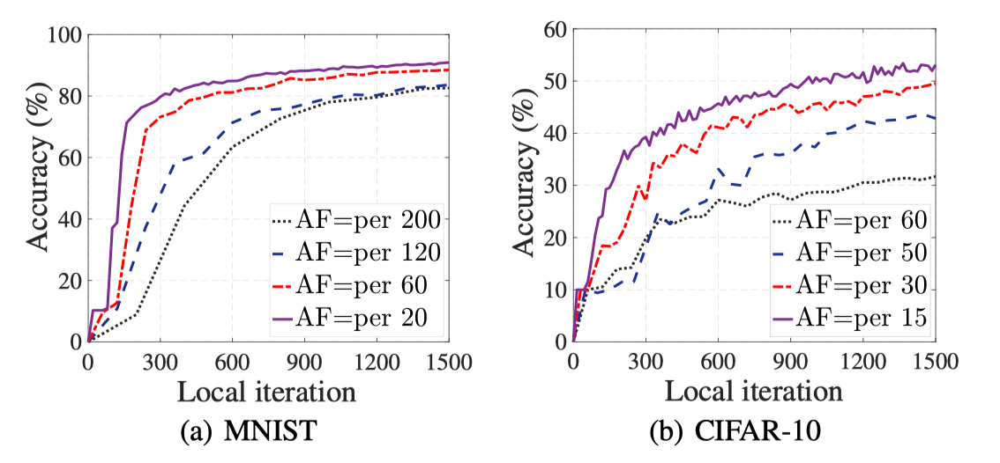

其中AF表示若干次局部迭代执行一次云聚合。实验证明，当分布式节点的训练数据不均衡时，当频率增大时，模型的精度和收敛素速度都有提高。说明频繁的聚合很有必要，但会增加通信开销。

- **HFL的潜力**

在分布式计算节点中，可以**选择一些节点作为边缘聚合器**，对邻近节点进行**频繁的模型聚合**，然后边缘聚合器将边缘模型更新提交到云中进行全局聚合。

**搭建HFL仿真系统：**在30个节点中选择3个节点作为边缘聚合器，每个聚合器随机选择10个节点进行聚合。

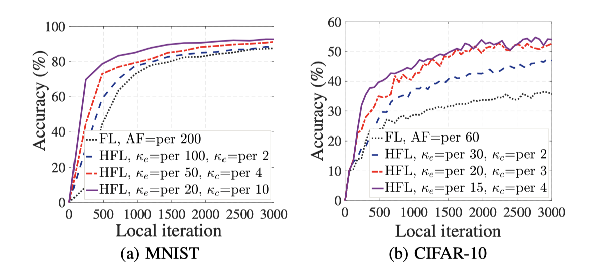

如图，$\kappa_{e}$和$\kappa_c$是边缘和云端的聚合频率，例如$\kappa_e$为100，$\kappa_c$为2说明本地iter聚合100次后执行边缘聚合，边缘聚合2次后执行云端聚合，也就是200次本地聚合包括了2次边缘聚合和1次云端聚合。由图中可以看到，HFL的性能提高。

### B、边缘和云聚合的技巧

通过调整计算节点的数据分布，研究了聚合技巧，主要分三点：

1. EdgeBalanced：每个边缘聚合器分配10个节点，每个节点具有不同类别的训练数据，即每个边缘聚合器从10个类别中取一个均匀采样的数据集
2. EdgeImbalanced：为每个边缘聚合器尽可能分配类别相同的节点，使其数据分布倾斜。
3. EdgeRandom：随机分配，每个边缘聚合器数据集仍是不平衡的，但比EdgeImbalanced要平均些

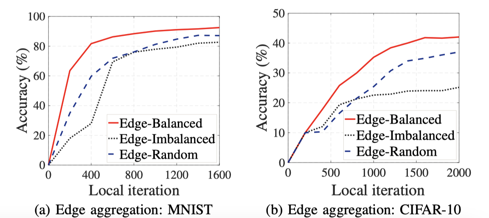

如图所示，其中$\kappa_e$为50，$\kappa_c$为4。图像可以看到，在固定$\kappa_e$和$\kappa_c$的情况下，使**边缘聚合器上的训练数据更接近均匀分布**，可以显著提高联邦学习性能，减少所需的通信次数。

接下来讨论固定$\kappa_e$改变$\kappa_c$的情况。

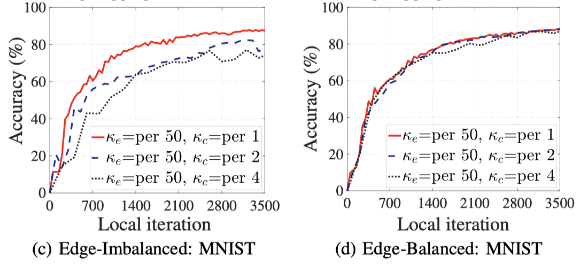

图中可以发现，在Imbalanced的情况下，$\kappa_c$增大（降低云聚合的频率）会使性能下降，但在balanced中影响不大。这意味着如果**边缘聚合器的训练数据更接近均匀分布**，可以**避免频繁的云聚合而不降低性能**，从而进一步节省系统的通信成本。

### C、架构思考

1. 频繁的模型聚合有助于获得更好的FL模型，但云通信的开销需要解决；
2. HFL在可接受的通信成本的边缘允许频繁的模型聚合；
3. 在HFL框架下，使边缘聚合器上的训练数据更接近均匀分布至关重要。

---

## 3 SYSTEM DESCRIPTION AND PROBLEM DEFINITION

### A、分层联邦学习系统

假设有1个云服务器和$N$个分布式节点，每个分布式节点都有不平衡的数据分布。选择分布式的子集$\mathcal{N}_{e} \subset \mathcal{N}$作为边缘聚合器。

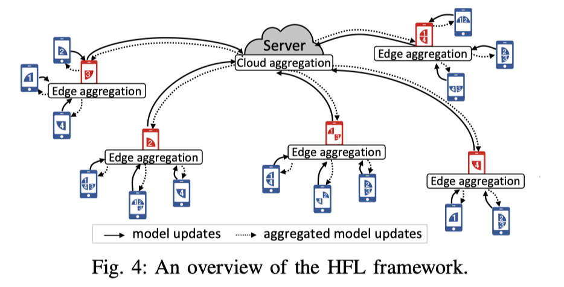

每一轮云聚合中，边缘聚合器从云服务器下载学习模型，各个分布式节点再从边缘聚合器下载模型。在分别经过$\kappa_e$和$\kappa_c$轮次聚合后，将模型更新上传。

### B、问题解决

在HFL框架中，我们的***<u>目标是最小化边缘和云聚合带来的通信开销</u>***，具体来说，我们将通信成本最小化问题描述如下：

- CCM问题：给定$\mathcal{N}$和$\mathcal{N}_{e}$，怎么确定**节点——边缘**的关联，使得节点到边缘，边缘到云之间最小化通讯（当达到目标学习精度时停止）

设一个二进制变量$x_{e} \in\{0,1\}$表示节点$e$是否属于$\mathcal{N}_{e}$。属于则为1不属于则为0。

设一个二进制变量$y_{ne} \in\{0,1\}$表示节点$n$属于$\mathcal{N}$，是否与边缘$e$有连接，有则为1没有为0。

用$c_{ne}$表示节点$n$与边缘$e$之间通讯的开销，用$\kappa$表示云聚合总数，以达到学习精度。

则边缘与节点之间的通讯总开销为：
$$
C_{n e}(\boldsymbol{Y}, \kappa)=\kappa \kappa_{c} \sum_{n \in \mathcal{N}} \sum_{e \in \mathcal{N}_{e}} y_{n e} c_{n e}
$$
其中$\boldsymbol{Y}=\left\{y_{n e}\right\}_{\forall n \in \mathcal{N}, e \in \mathcal{N}_{e}}$表示节点到边缘的连接结果。同样的，设$c_{ec}$是边缘向云聚合器提交模型的通讯开销，则总开销可以表示为，其中$\boldsymbol{X}=\left\{x_{e}\right\}_{\forall e \in \mathcal{N}}$：
$$
C_{e c}(\boldsymbol{X}, \kappa)=\kappa \sum_{e \in \mathcal{N}_{e}} x_{e} c_{e c}
$$
则CCM问题可以正式表示为：

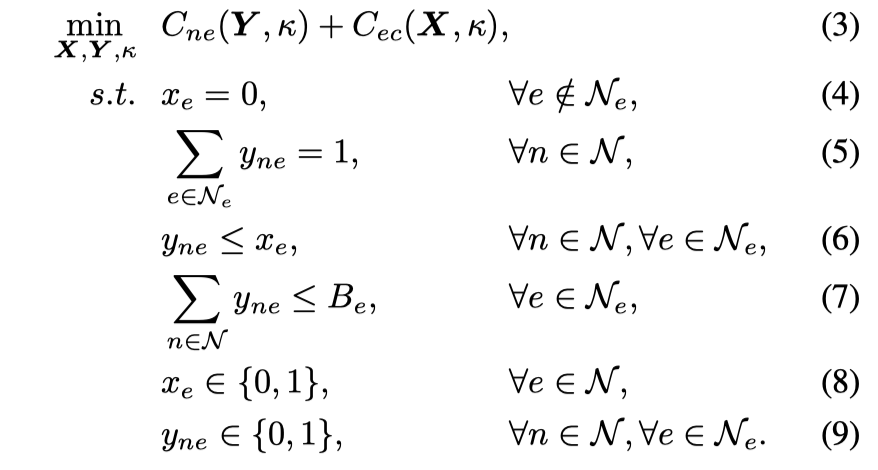

约束（5）表示每个节点必须与一个且只有一个边缘聚合器相关联，约束（6）表示必须选择候选边缘节点e作为边缘聚合器以支持来自节点n的关联，约束（7）限制了可以与边缘聚合器$e$关联的节点数量。

### C、问题分析

- 要在X和Y上做出决策，将每一轮云聚合的通信成本降到最低。
- 要减小$\kappa$的值，减小云聚合总数。
- X和Y的决定会无形影响$\kappa$的值。

综上，解决CCM比较困难。

---

## 4 DESIGN OF SHARE

本节提出了SHARE的优化框架来解决CCM。

### A、SHARE的概述

解决CCM有两个优化方向：（1）最小化每轮云聚合通信开销；（2）减少所需的云聚合次数。

将CCM分为2个子问题：

（1）PCCM（per round communication cost）：最小化每一轮的通信开销。

为了精确确定$\kappa$的影响，采用了KL散度来量化边缘聚集点上数据分布的平衡程度。

（2）KMM（KLD mean minimization）：边缘聚合器数据分布的KL散度均值最小化问题，即使边缘聚合器的数据分布更接近均匀分布。

通过**平衡两个子问题之间的权衡**，将原问题转化为数据分布感知通信代价最小化(DD-CCM)问题。我们最终设计了两个轻量级算法，分别优化高度耦合的**<u>边缘聚合器选择</u>**和**<u>分布式节点关联决策</u>**。

### B、问题转换

- PCCM

在每一轮云聚合中，目标是通过对X和Y进行决策，使分布式计算节点、边缘聚合器和云聚合器之间的总通信成本最小：
$$
\min _{\boldsymbol{X}, \boldsymbol{Y}} J_{c}(\boldsymbol{X}, \boldsymbol{Y})=\kappa_{c} \sum_{n \in \mathcal{N}} \sum_{e \in \mathcal{N}_{e}} y_{n e} c_{n e}+\sum_{e \in \mathcal{N}_{e}} x_{e} c_{e c},\quad s.t. constraints : (4), (5), (6), (7), (8), (9).
$$
其中用$P_{n}=P\left(\boldsymbol{D}_{\boldsymbol{n}}\right)$表示节点$n$的数据分布，$P_{e}=P\left(\cup_{\forall n \in \mathcal{M}_{e}} \boldsymbol{D}_{\boldsymbol{n}}\right)$表示边缘聚合器$e$的数据分布，其中$\mathcal{M}_{e}$是边缘$e$相关联的节点集合。并且每个节点的数据分布是未知的，可以根据模型更新中推断出来。

- KMM

目标是通过对X和Y进行决策，最小化边缘聚合器数据分布与均匀分布之间的KL散度均值：
$$
\min _{\boldsymbol{X}, \boldsymbol{Y}} J_{d}(\boldsymbol{X}, \boldsymbol{Y})=\frac{1}{|\mathcal{E}|} \sum_{e \in \mathcal{E}} D_{K L}\left(P_{e}|| P_{u}\right)\quad s.t. constraints : (4), (5), (6), (7), (8), (9).
$$
其中$\mathcal{E}$是边缘$e$的集合，$P_e$是边缘$e$的数据分布，$P_u$是均匀分布。

以上2个问题的最优结果不能同时出现，因为目标存在竞争，故需要权衡是根据通信成本还是数据分布决定连接情况。为了平衡这种权衡，我们引入参数$\gamma$来调整通信成本和数据分布KL散度，即将原来的CCM问题转换成了DD-CCM问题：
$$
\min _{\boldsymbol{X}, \boldsymbol{Y}} J_{c}(\boldsymbol{X}, \boldsymbol{Y})+\gamma J_{d}(\boldsymbol{X}, \boldsymbol{Y})\quad s.t. constraints : (4), (5), (6), (7), (8), (9).
$$

- 挑战

（1）我们需要确定选多少个、以及哪些个作为边缘。选多了会增加通信成本，而且边缘应该离节点和云服务器都近，但这两个距离之间存在冲突。

（2）如何选择节点和相应的边缘连接起来。有要考虑节点和边缘之间要近，从而减少通信开销；还要考虑数据分布情况，这二者是冲突的。即使我们忽略了边缘聚合器的数据分布上述问题仍然是NP复杂的。

### C、算法设计

首先解决以下问题：给定一组边缘聚合器，如何将分布式计算节点关联到它们上，使通信成本和数据分布发散同时最小化？

我们先设计了一种GoA算法来决定节点到边缘之间的连接，在GoA的基础上，又设计了一种局部搜索算法LoS来反向优化边缘的选择。

- ***GoA算法***

给定边缘$e$我们需要确定每个节点属于哪个$e$，可以表示为：

我们贪婪地把每个节点关联到一个聚合器，该局和其最小化目标参数（13），直到所有的节点都被调度。

该算法遍历所有无关联节点和可用的边缘聚合器，并计算$\Delta J_{n e}=\kappa_{c} c_{n e}+\gamma \frac{1}{|\mathcal{E}|} \Delta d$，其中前一项是节点$n$与边缘$e$之间的通信开销，后一项是边缘$e$与节点$n$数据分布KL散度的减少量，定义为$\left.\Delta d \leftarrow D_{K L}\left(P_{e}+P_{n} \| P_{u}\right)-D_{K L}\left(P_{e} \| P_{u}\right)\right)$。基于以上计算值，求出$\Delta J_{ne}$的最小值时，节点与边缘的关联对，重复执行算法，直到所有的节点都被选中与边缘连接。

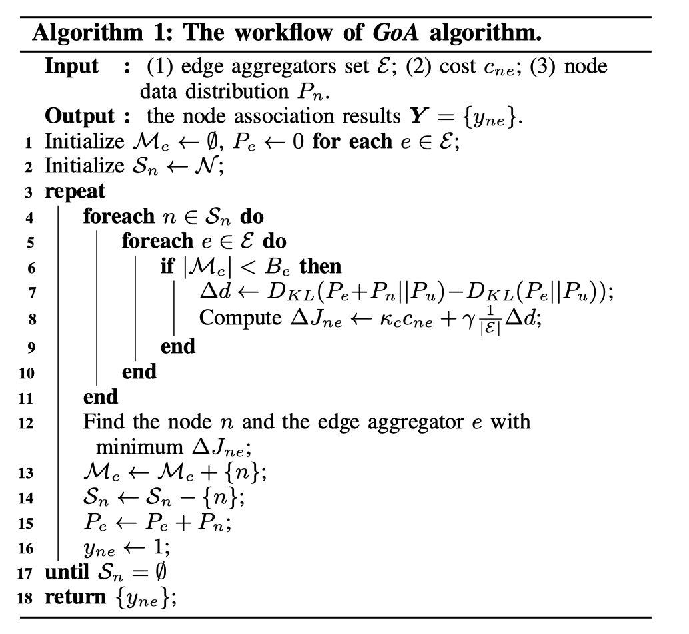

- ***LoS算法***

主要研究如何确定边缘聚合器的选择问题。其问题是一个$O\left(2^{\left|\mathcal{N}_{e}\right|}\right)$问题，为了节省时间，建立了一种本地搜索算法。定义$J_m(\mathcal E_s)$是给定边缘集合$\mathcal E_s$时式子（13）的最优值，当边缘设定违反14-17的约束条件的话，令$J_m(\mathcal E_s)$为$+\infty$。定义：
$$
J\left(\mathcal{E}_{s}\right)=J_{m}\left(\mathcal{E}_{s}\right)+\sum_{e \in \mathcal{E}_{s}} c_{e c}
$$
上式为DD-CCM的最优值。

首先随机初始化边缘可行解集合$\mathcal E_s$，然后执行以下三种局部更新操作：

（1）随机选择一个不在当前解中的$e$，利用算法GoA计算$J\left(\mathcal{E}_{s}+\{e\}\right)$，如果$J\left(\mathcal{E}_{s}+\{e\}\right)<J\left(\mathcal{E}_{s}\right)$则把该边缘$e$加入到集合$\mathcal E_s$中。

（2）随机选择一个在当前解中的$e$，利用算法GoA计算$J\left(\mathcal{E}_{s}-\{e\}\right)$，如果$J\left(\mathcal{E}_{s}-\{e\}\right)<J\left(\mathcal{E}_{s}\right)$则把该边缘$e$移除到集合$\mathcal E_s$中。

（3）随机选择一个不在当前解的$e$，再选一个在当前解的$e^{\prime}$，计算$J\left(\mathcal{E}_{s}+\{e\}-\{e^{\prime}\}\right)$，若$J\left(\mathcal{E}_{s}+\{e\}-\{e^{\prime}\}\right)<J\left(\mathcal{E}_{s}\right)$，则交换两个边缘选择。

---

## 5 PERFORMANCE EVALUATION

### A、评价方法

- 实验设置

用了2个数据集和相应的模型：（1）MNIST和标准的CNN模型；（2）Cifar10和Resnet18网络。

从Internet Topology Zoo选取了三种网络拓扑类型的节点，并计算了网络节点之间的距离信息，得到了每个节点中的最短距离。在每个网络拓扑中，都包含一个位于美国西雅图的额外节点，以表示云聚合器。数据分布：MNIST每个设备上只有一种label，cifar上每个设备有3种label。

设备子集$N$，边缘聚合器$N_e$，每个边缘聚合器的$B_e$值设置在[3,10]之间。通信成本通常由网络的拥塞水平或**数据包所经过的距离**来反映。本位采用：***两个通信节点之间的物理距离，乘以一个系数和模型大小来模拟通信代价***，其中$d_{ne}$和$d_{ec}$是距离（km），$S{m}$表示模型大小（MB）。
$$
c_{ne}=0.002\times d_{ne} \times S_m
$$

$$
c_{ec}=0.02\times d_{ec} \times S_m
$$

benchmark：

- C-FL：直接云聚合
- CC：采用CPLEX混合整数规划动态求解器，只降低通信开销而忽略数据分布
- DG：只考虑数据分布，而忽略通信节点之间的通信代价

### B、基于云的FL性能比较

（1）比较SHARE和C-FL的性能差距

首先研究了云聚合频率相同的情况下（$AF=\kappa_e \times \kappa_c$），达到目标学习精度的通信成本。我们固定$\kappa_e=5$，改变AF的值从5-50，可见SHARE的通信效率改善了很多。

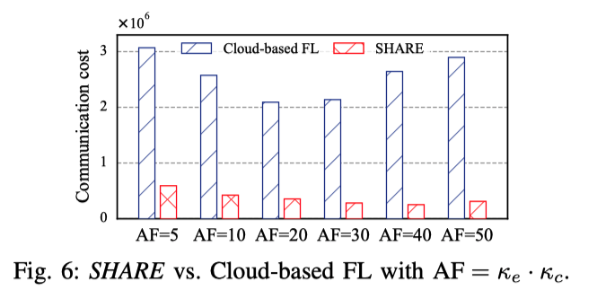

另一方面，设置$\kappa_e=AF$，通过改变$\kappa_c$来探究SHARE在不同云聚集频率下的性能。1、利用SHARE边缘聚合可以显著降低通信成本。2、当降低云聚合频率的时候，SHARE可以进一步降低通信成本。

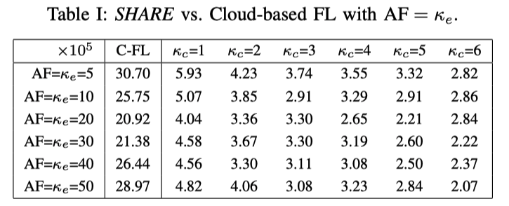

### C、与HFL基准的比较

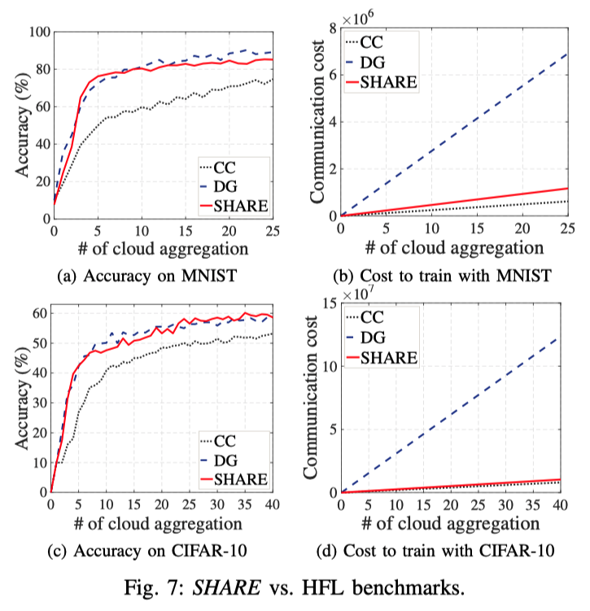

固定了$\kappa_e$和$\kappa_c$，通信成本逼近CC，准确率逼近DG，说明在二者之间取得了平衡。

### D、参数的影响

我们探讨了$\kappa_e$，$\kappa_c$，$\gamma$的影响，分别固定了$\kappa_e$和$\kappa_c$然后改变另一项。

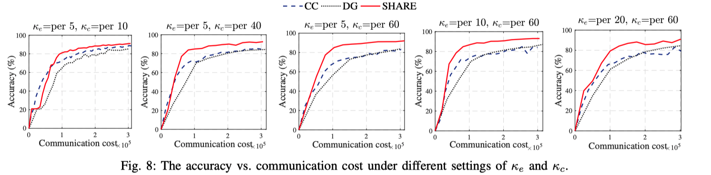

随着$\kappa_c$的增大，benchmarks和SHARE的最终距离在增大，因为SHARE已经平均了数据，可以保证学习绩效。固定$\kappa_c$，增大$\kappa_e$，模型可以以更少的通信消耗收敛。

接着分析了$\gamma$的影响。$\gamma$越大表示对数据分布的关注越大，通信消耗的也会更多，但是KLD的平均值会减少，准确率会更高。图b展示了需要达到准确率90%所需要的通信消耗，可以看到并推断：如果$\gamma$小了，就会少考虑数据分布的影响，多考虑通信开销的影响，所需总共需要较多的通信次数，反之大了，考虑数据分布会很多，但是通信开销不是最优解。

所以，最好的方式是前期多利用$\gamma$的影响（数据分布），等利用好了边缘聚合器之后，再降低$\gamma$的效果，多考虑通信。

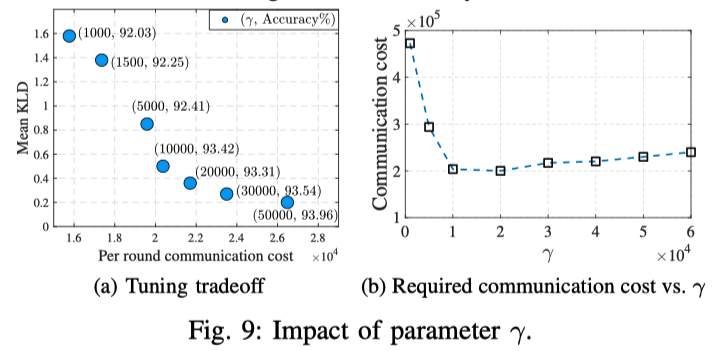

### E、网络拓扑的影响

不同的网络拓扑下，SHARE都要由于两种基准集。