# 基于QT和OpenCV条形码识别应用

本项目是去年年末实现的一个小课设，属于初步了解OpenCV之后做的一个简单的小尝试，理论很简单，本人也不是专门做CV的，大佬轻喷，感兴趣的朋友可以了解下。**<u>*项目已经开源，文案转载需标明出处！*</u>**

废话少说，先放代码：

下面是有关本项目实现的一些原理和介绍。

## 1 基本介绍

条形码技术在20世纪初伴随着计算机的应用产生,并跟随着计算机的普及不断发展，形成了一种的新的用于自动识别的综合性技术，它涵盖范围非常广，涉及光电，通信以及条形码理论等各个方面。

本项目旨在研究一种基于OpenCV图像处理的条形码处理系统，利用**QT**实现交互可视化界面。由于条形码种类繁多，本项目主要将当前使用最为普及广泛的**EAN-13条形码**作为研究对象，对先前采集好的条形码图片进行灰度处理、滤波、校正等操作，最终实现条形码的识别。

---

## 2 EAN-13条形码介绍

### 2.1 一维条形码EAN-13介绍

条形码按编码格式分为一维码(One Dimensional Barcode，1D)和二维码(Two Dimensional Code，2D)两种。EAN-13商品条形码由左侧空白区、起始符、左侧数据符、中间分隔符、右侧数据符、校验符、终止符、右侧空白区及供人识别字符组成。具体EAN-13条形码如图所示。

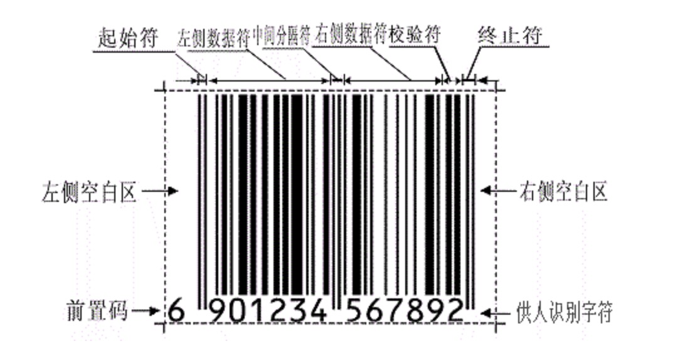

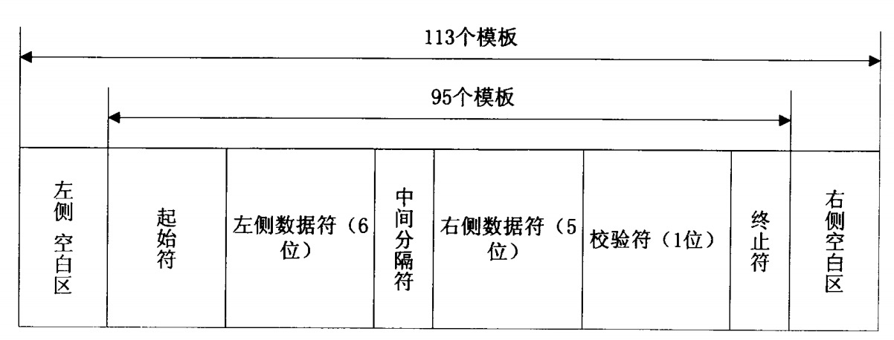

其各个组成部分具体含义为：（1）左侧空白区是位于条形码最左边与空的反射率一样的区域，它的最小宽度为11个模块宽；（2）起始符是条形码信息开始的标志，共占用三个模块；（3）左侧数据符是位于中间分隔符和起始符之间的一组条形码字符，表示六位数字信息，占用42个模块；（4）中间分隔符位于左侧和右侧数据符之间，占用5个模块；（5）右侧数据符位于中间分隔符和校验符之间，表示5位数字信息；（6）校验符位于右侧数据符的右侧，占用7个模块；（7）终止符标志条形码信息的结束，占用3个模块；（8）右侧空白区位于条形码最右侧，与空的反射率相同的区域。最小宽度为7个模块。

### 2.2 EAN-13编码规则

EAN-13码采用模板组合法来进行编码。通常把条形码宽度的基本单位称之为模板宽度。EAN-13码可以表示0-9这10个数字字符，两个条和两个空共同构成一个字符，总共有7个模板的长度，其中每个条的最小宽度为一个模板长度，最长不超过4个模板长度，且必须为模板长度的整数倍，一般用二进制“1”表示条，“0”表示空。

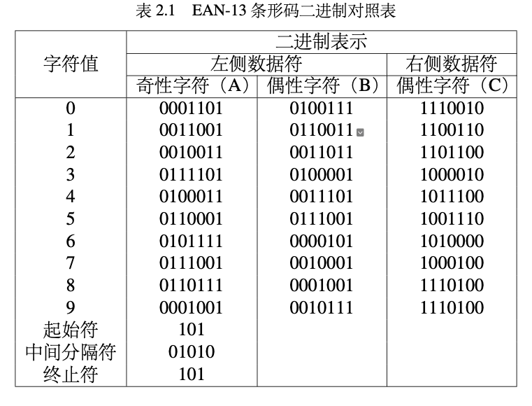

### 2.3 校验方法

条形码在印制过程中难免出现一些质量低的或者在运输过程中一些破损的条形码，如果没有校验位，就会造成识读设备误读信息。因此，条形码的校验是确保条形码识读正确的重要手段。条形码校验的主要步骤如下：

设条形码的任意一位数字码为$x_i(x_i=1,2,3,...,13)$

（1）以最后一位校验位为第一位，从右往左依次按顺序排列。

（2）从第二位开始，求出所有偶数项的和，然后乘以3得积$N_1$。

（3）从第三位开始，求出所有奇数项的和，得$N_2$。

（4）将$N_1$和$N_2$求和得到$N_3$，$N_3=N_1+N_2$。

（5）将$N_3$除以10得到余数，再以10为模，计算余数的补码，最后得到的即为校
验位C位。

例如假设EAN-13条形码的数字为6901234567892，其中校验码$C=2$，具体校验步骤如下：

（1）最右侧校验码“2”为第1位，依次从右往左排序。

（2）求$N_1$，$N_1=3\times(9+7+5+3+1+9)=102$。

（3）求$N_2$，$N_2=8+2+4+2+0+6=16$。

（4）求$N_3$，$N_3=102+16=118$。

（5）$N_3\%10=8$，校验位$C=10-8=2$。

---

## 3 图像预处理

### 3.1 图像灰度处理

首先分别给R、G、B这3个颜色分量赋个权值系数，然后求取加权平均值，最后再把计算得到的结果赋给3个分量作为该目标像素点的灰度值，计算公式如式所示：
$$
\mathrm{F}(\mathrm{x}, \mathrm{y})=\left[\mathrm{R}(\mathrm{x}, \mathrm{y}) \mathrm{W}_{\mathrm{r}}+\mathrm{G}(\mathrm{x}, \mathrm{y}) \mathrm{W}_{\mathrm{g}}+\mathrm{B}(\mathrm{x}, \mathrm{y}) \mathrm{W}_{\mathrm{b}}\right] /\left(\mathrm{W}_{\mathrm{r}}+\mathrm{W}_{\mathrm{g}}+\mathrm{W}_{\mathrm{b}}\right)
$$
其中$\mathrm{W}_{\mathrm{r}}$、$\mathrm{W}_{\mathrm{g}}$、$\mathrm{W}_{\mathrm{b}}$分别为R、G、B的系数，这3个系数是通过大量的实验获得的，能够很好地满足人们视觉的感受，这其中一组最佳的权值系数为$\mathrm{W}_{\mathrm{r}}=0.229$、$\mathrm{W}_{\mathrm{g}}=0.587$、$\mathrm{W}_{\mathrm{b}}=0.114$。

### 3.2 图像的边缘提取

条形码经过了上述的灰度处理后，仍具有256种颜色，不利于条形码的识别，由于条形码识别过程比较单一，故采用先二值化处理，再边缘提取的方式，从而更好地得到条形码的相关特征，方便后续的几何校正。

二值化的过程是先确定图像中各灰度值在直方图中的分布情况，然后按照统计的概率分布确定一个合适的的阈值，最后通过比较图像中各个像素点的灰度值和选定阈值的大小来实现图像的二值化过程。比较过程中该像素点的灰度值比阂值大，则将该点的灰度值置为1；反之，如果该像素点的灰度值比阈值小，则将该点的灰度值置为0。

**双峰法**是基于灰度直方图的简易阈值确定法。一般来说，图像中背景和目标灰度值有明显区别的高对比度图像，其灰度直方图呈现双峰分布。这样，直方图中波谷处所对应的灰度值能够很好地将灰度图像划分为背景和目标两个区域。其示意图如图所示：

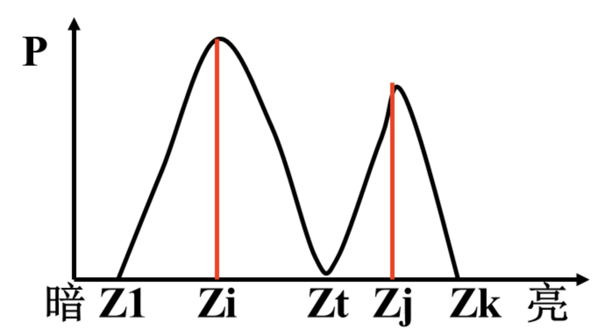

从图中可以看出该方法仅对目标与背景有较强对比度的图像适用。对于本项目来说，所提取的灰度直方图如图所示：

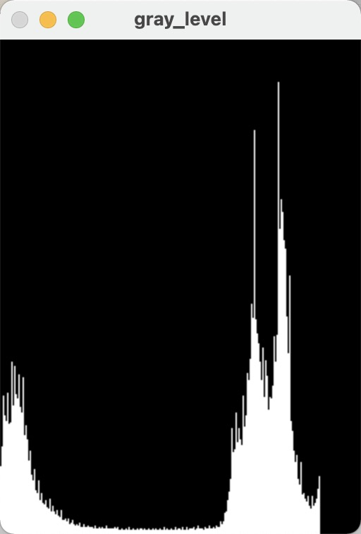

可以看到其背景和目标两个波峰十分明显，故采用双峰直方图方法进行二值处理十分合理。

图像二值处理的目的是为了凸显图像的边缘信息，在二值处理过后，边缘部分的提取主要采用的是Sobel算子。Sobel算子具有两个3$\times$3窗口，每个窗口可以扫描九个像素点，从而获取其相应方向的梯度值。2个窗口矩阵分别代表横向和纵向，将之与图像作平面卷积，即可分别得出横向及纵向的亮度差分近似值。如果以$A$代表原始图像，$G_x$及$G_y$分别代表经横向及纵向边缘检测的图像灰度值，其公式如式所示：
$$
G_x=\frac{1}{8}\times\begin{bmatrix}-1 & 0 & +1 \\-2 & 0 & +2 \\-1 & 0 & +1 \end{bmatrix} \quad and \quad G_y=\frac{1}{8}\times\begin{bmatrix}+1 & +2 & +1 \\0 & 0 & 0 \\-1 & -2 & -1 \end{bmatrix}
$$
图像的每一个原素的横向及向灰度值通过以下公式结合，便可以来计算该点灰度的大小：
$$
G=\sqrt{G_{x}^{2}+G_{y}^{2}}
$$
经过计算后，条形码的灰度图和边缘提取效果如图所示：

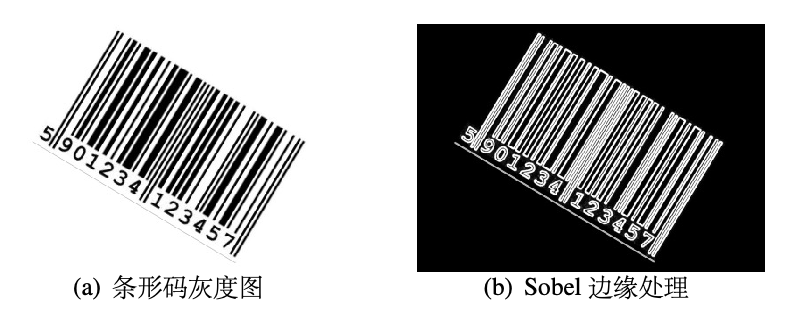

### 3.3 图像的几何校正

为了对采集的倾斜图像进行校正，需要两个步骤：第一，需对倾斜图像进行倾斜角的检测；第二，对倾斜图像进行旋转校正，使检测的倾斜角归0。

获取条形码的倾斜角度，需要利用到图片的频域信息，即将图片进行傅里叶变换，得到的傅里叶频谱中亮度值代表了频率变化的强弱，直线的方向代表了频率变化的方向，如图所示：

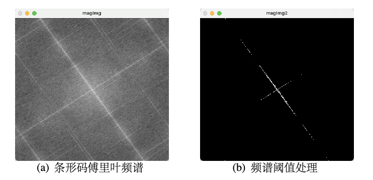

图a的傅里叶频谱中最亮的那条线就是与一维码黑白相间条纹相垂直的方向，找到这条线的角度，就可以计算出一维码的校正角度。

利用**霍夫(Hough)变换**可以对倾斜图像进行倾斜角度检测。Hough变换通常用于检测图像中的直线，其检测原理是将图像空间映射到参数空间，参数空间一般采用极坐标表示，两者的转换公式如式：
$$
x \cos \theta+y \sin \theta=\rho
$$
其中，$(x,y)$是图像空间的直角坐标，$(\rho,\theta)$是参数空间的极坐标。这样，图像空间中的一条直线会被映射成参数空间的一个点，而图像空间中的一个点会被映射成参数空间的一条曲线，其空间映射图如图所示：

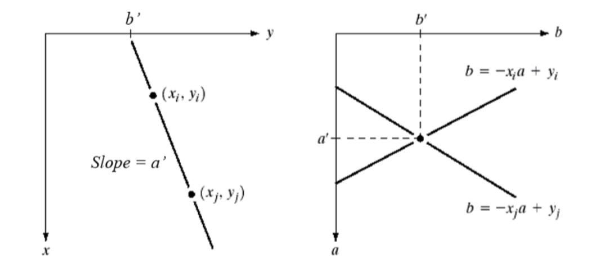

从上述的Hough变换原理可以看出，对于图像中的一条直线，经过空间映射后，该直线上的所有点所对应的正弦曲线必定相交于一点。基于这一点，可以将图像空间中的某条直线的检测问题转换为在参数空间寻找局部最大值的问题。最终条形码频域的Hough变换如图所示：

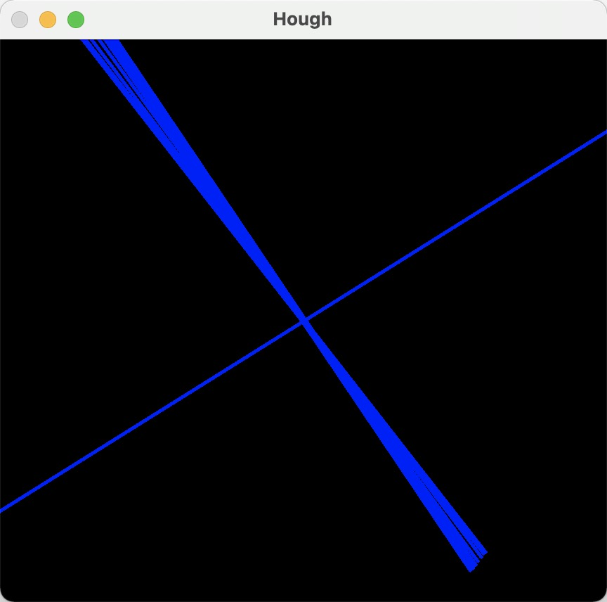

在经过Hough变换检测出倾斜图像的倾斜角度后，需对图像进行旋转校正。传统的图像旋转是以图像的中心点为基准进行旋转，旋转前后得到的点距离图像中心的距离是不变的。假设对直线$L$进行旋转，旋转后图像为$L^\prime$，直线$L$的极坐标可以表示为：
$$
\left\{\begin{array}{l}
x=r \times \cos \beta \\
y=r \times \sin \beta
\end{array}\right.
$$
变换后图像$L^\prime$表示为：
$$
\left\{\begin{array}{l}
x^{\prime}=r \times \cos (\beta-\alpha)=r \times \sin \beta \times \sin \alpha+r \times \cos \beta \times \cos \alpha \\
y^{\prime}=r \times \sin (\beta-\alpha)=r \times \sin \beta \times \cos \alpha-r \times \cos \beta \times \sin \alpha
\end{array}\right.
$$
将以上式子联立可以得到：
$$
\left(\begin{array}{l}
x^{\prime} \\
y^{\prime} \\
1
\end{array}\right)=\left(\begin{array}{ccc}
\cos \alpha & \sin \alpha & 0 \\
-\sin \alpha & \cos \alpha & 0 \\
0 & 0 & 1
\end{array}\right) \cdot\left(\begin{array}{l}
x \\
y \\
1
\end{array}\right)
$$
其逆运算表示为：
$$
\left(\begin{array}{l}
x \\
y \\
1
\end{array}\right)=\left(\begin{array}{ccc}
\cos \alpha & -\sin \alpha & 0 \\
\sin \alpha & \cos \alpha & 0 \\
0 & 0 & 1
\end{array}\right) \cdot\left(\begin{array}{l}
x^{\prime} \\
y^{\prime} \\
1
\end{array}\right)
$$
这也是最终的图像旋转公式，由于旋转前后图像的长宽并不一致，导致旋转后得到的图像周边存在块状的空白区域，处理的过程中用白色补充即可。

---

## 4 条形码识别

### 4.1 条形码识别原理

AN-13码每个字符由7个模块构成，交错由两个空和条构成，因此EAN-13码是一种(7，2)格式的条形码，并且每个条和空的宽度都不超过4个模块，且必须为模板长度的整数倍。一般用二进制“1”来表示“条”，用二进制“0”来表示“空”。

假定一个数组$A=(a_1,a_2,a_3,a_4)$表示一个条形码字符，根据其编码方式，可以了解到其具备两个性质，一是$a_i$为整数，且$1\leq a_i\leq 4$；二是$a_1+a_2+a_3+a_4=7$。

条形码字符宽度定义如图所示：

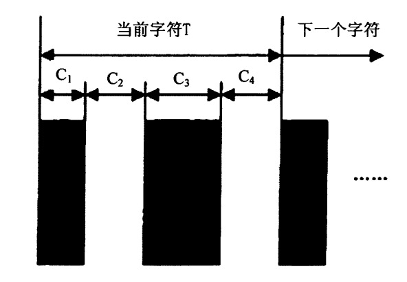

其中$C_1$、$C_2$、$C_3$、$C_4$表示每个字符中邻近4个条空的宽度，$T$为当前字符的宽度，定义一个字符的单位模块宽为$N$，则$N=T/7$，$T=C_1+C_2+C_3+C_4$，假设条形码条和空分别占单位模块的个数为$M_i$，则条形码的“条”和“空”的宽度$C_1$、$C_2$、$C_3$、$C_4$的值给定，则$M_i=C_i/N$。因此通过$M_i$就可以知道条形码的编码。

在扫描的过程中，需要确定扫描条形码的高度位置，由于经过测验，利用上一章所述方式进行旋转的方式准确定较高，故在此直接选取旋转后条形码的高度一半的位置进行扫描。

在条形码的扫描方向和高度确定之后，就要对条形码的字符数据进行识别，这需要对二进制表示的判断进行判断，相当于对条形码所表示的数据进行解码。EAN-13是一种（7，2）码，是一种多元素宽度的条形码，由于条形码有时存在部分缺损的情况，故采用归一化处理后再进行判断。

在上图中，设$T_1=C_1+C_2$，$T_2=C_2+C_3$，其中$T_1$和$T_2$为相似边距离值，用$AT_i(i=1,2)$来定义$T_1$和$T_2$归一化的值。则存在：
$$
T_{1} / T<2.5 / 7 & \quad \quad AT_{i}=2 \\
2.5 / 7<T_{1} / T<3.5 / 7 & \quad \quad AT_{i}=3 \\
3.5 / 7<T_{1} / T<4.5 / 7 & \quad \quad AT_{i}=4 \\
4.5 / 7<T_{1} / T & \quad \quad AT_{i}=5
$$
以下两张表分别表示条形码字符值与$AT_i$归一化值一一对应关系，以及正向译码时，字符编码与归一化值的对应关系：

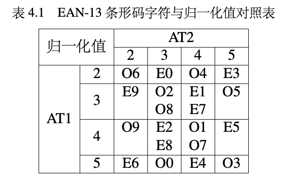

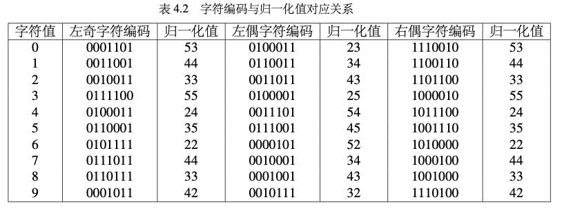

可以发现，条形码字符值与归一化值大多数都是一一对应的关系，但是有4种情况除外：左侧“O1”和右侧“E7”对应的归一化值均为44；左侧“E2”和右侧“E8”对应的归一化值为33；左侧“E1”和“E7"对应的归一化值均为“34”；左侧“E2”和“E8”对应的归一化值均为43。这几种情况需要另外从其条空宽度的特点进行判别。

### 4.2 识别结果分析

通过前面所介绍的识别方式，便可以实现一维码的识别，为了更好的进行识别系统的交互，本项目在MacOS系统下基于QT制作了可交互界面，运行窗口如图\ref{4-3}所示。整个显示界面上方包括四个图片显示窗口，分别用来显示原图、Sobel边缘提取图、Hough直线图和最终校正后图像。下方为控制台和显示窗口，对项目进行的操作有四种，分别是打开图片、图像预处理、识别条形码以及关闭项目。

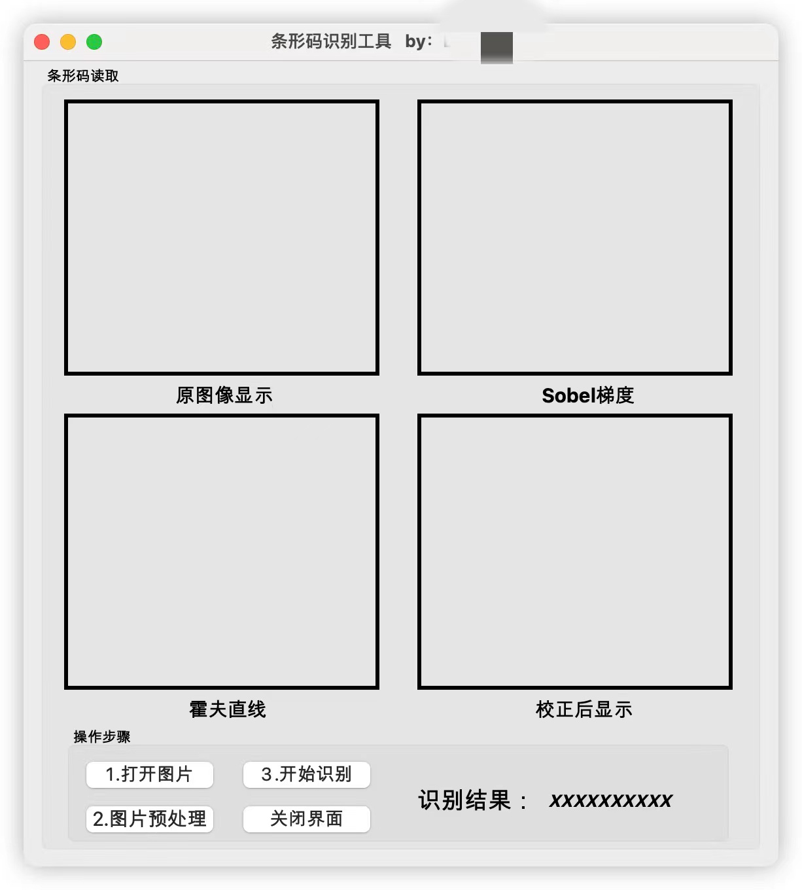

整体操作步骤为：

（1）打开图片：点击此按钮后，会进入到图片选择窗口，选择相应的需要识别的条形码图片后，便可以在上方第一个图像显示窗口显示原图像。

（2）图像预处理：点击此按钮后，执行图片预处理操作，上方的四个图片显示窗口会显示对应的处理过后的图片。

（3）开始识别：点击此按钮后，对处理后的图片执行识别操作，下方识别结果显示相应的识别后数字。

（4）关闭项目：点击关闭后结束项目。

识别样式如图所示：

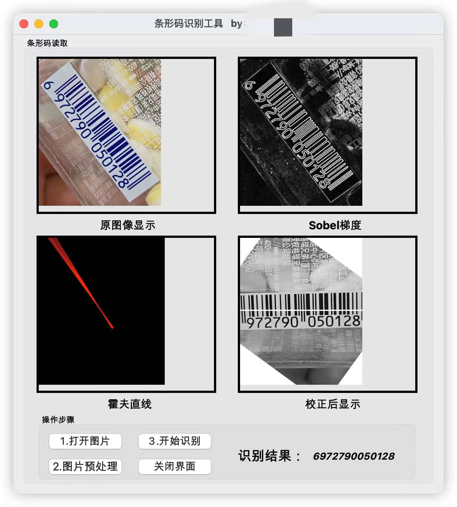

---

## 5 小结

其实目前有很多开源的二维码一维码识别库，例如Zbar等，大家有兴趣的可以了解。本项目为了更加熟悉图像的相关操作，所以很多已有的函数都是自己实现的，识别效果也不如那些常见的包准确，而且也没有加入视频流的处理，感兴趣的小伙伴们可以加油完善。