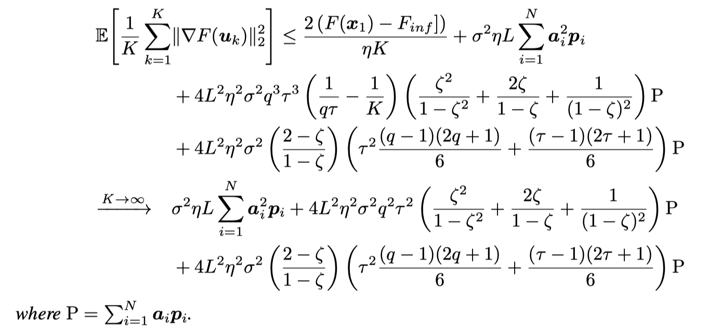

# Multi-Level Local SGD: Distributed SGD for Heterogeneous Hierarchical Networks

[toc]

## Abstract

我们提出了多级局部SGD，一种分布式随机梯度方法，用于学习**平滑、非凸**目标。我们的网络模型由一组不相连的子网络组成，有一个中心和多个客户，每个客户效率不同。中心通过一个连接但不一定完整的网络交换信息。在我们的算法中，子网络执行一个分布式的SGD算法，使用一个中心辐射型的范例，并且中心周期性地与邻近的中心平均他们的模型。

我们首先提供了一个统一的数学框架来描述多级局部SGD算法。接着进行了理论分析，分析展示了对于收敛误差是由客户节点、中心网络拓扑、聚合次数等等因素决定的。通过仿真实验，验证了该算法在一个工作速度较慢的多层网络中的有效性。

---

## Introduction

传统分布式SGD，在每次迭代中，中心向客户发送一个模型。每个客户都对本地数据进行训练，采取一个梯度步，然后将本地训练的模型返回到中心取平均值。当中心和客户之间延迟较低时，分布式SGD很有效。延迟较高时，可以给到客户端之后执行多个梯度更新，这种方式称为**本地SGD**。

但如果客户端算力不同，则会存在掉队者。而且大部分都假设了一个中心辐射模型，这与真实情况不大相符。每个个体应该有一个集群头，然后通过一个更上层的网络通信。

基于以上原因，我们提出了多级局部学习算法MLL-SGD，每个子网络有一个中心服务器和一组客户端，上层连接一个集线器。每个子网络运行一个或多个本地SGD轮，客户端训练，然后在子网络的中心进行模型平均。集线器周期性地与集线器网络中的邻居对其模型进行平均。由于MLL-SGD平均每个本地训练周期，无论每个客户端采取多少梯度步骤，最终都不会减缓算法执行。

我们证明了MLL-SGD对于光滑和潜在的非凸损失函数的收敛性。接着假设数据是IID的，进一步分析了收敛误差与算法参数的关系。

贡献：

1、我们用异构工作者形式化了多级网络模型，并定义了该网络中训练模型的MLL-SGD算法。

2、从理论上分析了具有异质工作者的MLL-SGD的收敛保证。

3、进行了相关实验。

---

## System model and problem formulation

我们考虑有$D$个子网络，$D=\{1,...,D\}$，每一个子网络$d\in D$都有一个中心和一组客户端$M^{(d)}$，并且数量上$|M^{(d)}|=N^{(d)}$，我们将客户端所有的集合定义为$M=\bigcup^D_{d=1}M^{(d)}$，令$|M|=N$，每一个客户端$i$都有一组训练集$S^{(i)}$，令$S=\bigcup^N_{i=1}S^{(i)}$，所有$D$集线器的集合用$C$表示。集线器通过一个$G=(C,E)$进行通信，令$N_d=\{j|e_{d,j}\in E\}$表示在网络$D$的中心的邻居节点的集合。

设模型参数是$x$，我们的目的是使损失函数的均值最小化，即：
$$
F(\boldsymbol{x})=\frac{1}{|\mathcal{S}|} \sum_{s \in \mathcal{S}} f(\boldsymbol{x} ; s)
$$
其中$f(\cdot)$表示损失函数。客户端每一次局部迭代在本地运行SGD时，会抽出一小批数据执行，设$\xi$是随机抽样的一小批数据，并且令$g(\boldsymbol{x} ; \xi)=\frac{1}{|\xi|} \sum_{s \in \xi} \nabla f(\boldsymbol{x} ; s)$为这一小批数据的梯度，简写为$g(x)$。

**假设1：**

目标函数和小批量梯度满足以下条件：

1、目标函数$F$是连续可微的，并且梯度满足：$\|\nabla F(\boldsymbol{x})-\nabla F(\boldsymbol{y})\|_{2} \leq L\|\boldsymbol{x}-\boldsymbol{y}\|_{2}$，$L>0$。

2、$F$有下界。$F(x)\geq F_{inf}>-\infty$。

3、小批量梯度是没有偏差的，即$\mathbb{E}_{\xi \mid \boldsymbol{x}}[g(\boldsymbol{x})]=\nabla F(\boldsymbol{x})$。

4、存在标量$\beta \geq0$和$\sigma \geq0$，使得$\mathbb{E}_{\xi \mid \boldsymbol{x}}\|g(\boldsymbol{x})-\nabla F(\boldsymbol{x})\|_{2}^{2} \leq \beta\|\nabla F(\boldsymbol{x})\|_{2}^{2}+\sigma^{2}$。

上述假设1说明梯度不会变化太快，2说明了梯度的下界，3和4说明了每个客户端的数据**可以作为整体数据的具有相同方差的无偏差估计**。

---

## Algorithm

下面介绍多级局部SGD算法。

每个子网络并行排列，并且中心定期对模型进行平均。localSGD的步骤对应第5-10行，每个中心和客户端都会存储一个模型副本。对于客户端$i\in M^{(d)}$，其局部模型为$x^{(i)}$，我们表示中心$d$处的模型为$y^{(d)}$，客户端进行多次迭代，如第7行。为了表示每个工人的不同计算速率，我们使用了一种概率方法，每$\gamma$个时间步里，每个客户端$i$执行$\gamma^{(i)}$次迭代，其中$\gamma^{(i)}<\gamma$。因此我们定义一个$N$维的向量$p$，$p_i=\frac{\gamma^{(i)}}{\gamma}$是在第$k$次迭代中的梯度步长概率，客户端$i$在第$k$次的模型更新为：
$$
\boldsymbol{x}_{k+1}^{(i)}=\boldsymbol{x}_{k}^{(i)}-\eta \boldsymbol{g}_{k}^{(i)}
$$
其中$\eta$为学习率，$g_k^{(i)}$为：
$$
\boldsymbol{g}_{k}^{(i)}= \begin{cases}g\left(\boldsymbol{x}_{k}^{(i)}\right) & \text { w/ probability } \boldsymbol{p}_{i} \\ \mathbf{0} & \text { w/ probability } 1-\boldsymbol{p}_{i}\end{cases}
$$
对于每一个客户端$i$，我们分配一个正权重$w^{(i)}$，设$v^{(i)}$是一个归一化权重，其表示为：
$$
v^{(i)}=\frac{w^{(i)}}{\sum_{j \in \mathcal{M}^{(d(i))} w^{(j)}}}
$$
其中$d(i)$是客户端$i$所属的网络。每一个中心都将其模型更新为其子网络中工人模型的加权平均：$\boldsymbol{y}^{(d)}=\sum_{i \in \mathcal{M}^{(d)}} v^{(i)} \boldsymbol{x}^{(i)}$，如果所有的客户端都被平等对待，则$w^{(i)}=1$，一般情况下令$w^{(i)}=|S^{(i)}|$（类似于FedAvg）。

当每一个子网络进行$q\cdot \gamma$次迭代后，各中心和其邻居进行通信并平均模型（算法12行），分配给每个中心模型的权重由一个$D\times D$的矩阵$H$来决定：
$$
\boldsymbol{y}^{(d)}=\sum_{j \in \mathcal{N}^{(d)}} \mathbf{H}_{j, d} \boldsymbol{y}^{(j)}
$$
定义网络中的总权重为：$w_{t o t}=\sum_{i \in \mathcal{M}} w^{(i)}$，令$b$是一个$D$维的向量，并且$b_d=(\sum_{i\in M^{(d)}}w^{(i)})/w_{tot}$。则我们假设矩阵$H$满足以下几种条件：

**假设2：**

1、如果$(i,j)\in E$，那么$H_{i,j}>0$，否则$H_{i,j}=0$。

2、$H$为列随机，即$\sum_{i=1}^{D} \mathbf{H}_{i, j}=1$。

3、对于所有的$i,j\in D$，我们都有$b_iH_{i,j}=b_jH_{j,i}$。

上述假设说明$H$有一个简单的特征向量，右特征向量为$b$，左特征向量均为1，除此以外没有其他特征向量。通过以上方式定义$H$，客户端梯度的贡献和其权重成比例的结合在了一起，从而更好地拓展到多级网络模型。

---

## Analysis

可以看到，中心的模型本质上是无状态的，因为当中心的模型平均之后，其被分配到每个客户端。因此我们的分析集中在客户端是怎样进化的。我们首先根据客户端模型的演化提出了一个等效的MLL-SGD算法的公式，然后给出了我们关于MLL-SGD收敛的主要结果。

系统的行为可以用以下客户端模型更新规则作为总结：
$$
\mathbf{X}_{k+1}=\left(\mathbf{X}_{k}-\eta \mathbf{G}_{k}\right) \mathbf{T}_{k}
$$
其中$n \times N$的矩阵$\mathbf{X}_{k}=\left[\boldsymbol{x}_{k}^{(1)}, \ldots, \boldsymbol{x}_{k}^{(N)}\right]$，$n\times N$的矩阵$\mathbf{G}_{k}=\left[\boldsymbol{g}_{k}^{(1)}, \ldots, \boldsymbol{g}_{k}^{(N)}\right]$，还有$N\times N$的矩阵是一个时变算子，它捕获了MLL-SGD中的三个阶段：局部迭代，每个子网络中的中心平均，和所有中心的平均，定义$T_k$为：
$$
\mathbf{T}_{k}= \begin{cases}\mathbf{Z} & \text { if } k \bmod q \tau=0 \\ \mathbf{V} & \text { if } k \bmod \tau=0 \text { and } k \bmod q \tau \neq 0 \\ \mathbf{I} & \text { otherwise }\end{cases}
$$
对于本地的local计算，$T_k=I$，对于子网络的平均，$V$是一个$N\times N$的一个分块对角矩阵，每一块的矩阵$V^{(d)}$表示为$\mathbf{V}_{i, j}^{(d)}=v^{(i)}$，最后，所有子网络聚合的矩阵$Z$表示为：
$$
\mathbf{Z}_{i, j}=\mathbf{H}_{d(i), d(j)} v^{(i)}
$$
设$a$为一个$N$维向量，$\boldsymbol{a}_{i}=\frac{w^{(i)}}{w_{t o t}}$，表示客户$i$的权重，这些属性是必要的(但不是充分的)，以确保工人模型收敛到一个共识模型，其中每个工人的更新已根据工人的权重合并。

我们定义了一个加权平均模型:
$$
\boldsymbol{u}_{k}=\mathbf{X}_{k} \boldsymbol{a}
$$
通过对上式左右两边同时乘以一个a，可以得到：

我们注意到$u_k$是通过使用几个小批量梯度的加权平均的随机梯度下降步来更新的。由于$F(·)$可以是非凸的，所以SGD可以收敛到局部最小值或鞍点。因此，我们研究了当$k$增加时$u_k$的梯度。

**定理1：**

在假设1和假设2下，如果$\eta$对于所有的$i$都满足：
$$
\left(4 \boldsymbol{p}_{i}-\boldsymbol{p}_{i}^{2}-2\right) \geq \eta L\left(\boldsymbol{a}_{i} \boldsymbol{p}_{i}(\beta+1)-\boldsymbol{a}_{i} \boldsymbol{p}_{i}^{2}+\boldsymbol{p}_{i}^{2}\right)+8 L^{2} \eta^{2} q^{2} \tau^{2} \Gamma
$$
其中$\Gamma=\frac{\zeta}{1-\zeta^{2}}+\frac{2}{1-\zeta}+\frac{\zeta}{(1-\zeta)^{2}}$并且$\zeta=\max \left\{\left|\lambda_{2}(\mathbf{H})\right|,\left|\lambda_{N}(\mathbf{H})\right|\right\}$。

则经过$K$次迭代平均的平均**模型梯度的期望平方范数**有界如下:

式子13的第一部分和普通中心SGD一样，当$K$趋于无穷时，这一部分为0。第二个阶段也类似于中央SGD。如果随机梯度的方差较大，则收敛误差较大。

第三和第四项是依赖于中心网络拓扑结构的可加性误差。$\zeta$的值由H的第二大特征值(大小)给出，表明了枢纽网络的稀疏性。当客户端权重一致时，一个完全连通的枢纽图$G$将$\zeta =0$，而一个稀疏的$G$通常将$\zeta$接近1。有趣的是，$\zeta$只依赖于$H$，而不是$Z$或$V$，这意味着收敛误差不依赖于客户端权重在子网络中的分布。

我们还注意到第三和第四项取决于工人的加权平均概率$P$。收敛误差随着平均工人操作率的增加而增加。有趣的是，收敛误差并不依赖于$p$的分布，这意味着具有相同平均概率的倾斜均匀分布将具有相同的收敛误差。我们观察到，在给定某些概率的情况下，$\eta$的条件并不总是满足。

第三项和第四项也随着$q$和$\gamma$(每个枢纽网络平均步数和子网络内部平均步的局部迭代次数)的增大而增大。工人在当地培训的时间越长，而不协调他们的模型，他们的模型就会发散越多，导致更大的收敛误差。$\gamma$的影响比$q$更大，**所以应多进行内部的迭代计算。**

在下面的推论中，我们分析了算法1的收敛速度：

MLL-SGD与Local SGD和HL-SGD具有相同的渐近收敛速度。

---

## Experiments

数据：MNIST和Cifar10

对比实验：

- 分布式SGD：相当于Fedavg，$q=\gamma=1$，$p_i=1$，作为一个标准测试
- localSGD：集线器网络全连接，当对于所有的$i$都有$a_i=1/N$，$p_i=1$的时候，localSGD和MLLSGD相同并且$q=1$。
- HL-SGD：拓展为$q>1$。

对于所有的实验，我们让localSGD局部$\gamma$为32，对于HL-SGD和MLL-SGD令$q\gamma=32$，每32次计算进行一次统计。

我们搞了10个中心，每个中心连接10个客户端。对于MLL-SGD设置了2种构型，分别是$\gamma=4,q=8$和$\gamma=8,q=4$。对于分布式SGD和localSGD，集线器相当于连接通信，客户端分为5组，每组20人，每个组被分到的数据集百分比：5%、10%、20%、25%、40%，权重根据数据集大小进行分配。

图ac是损失，bd是精确率，随着$q$的增加，在保持$q\gamma = 32$的情况下，MLL-SGD改善并接近分布式SGD。因此，增加子网络训练轮数可以改善MLL-SGD的收敛行为。

我们研究了子网络的数量和规模如何影响MLL-SGD的收敛，从100个工人中，我们将他们分配到5个、10个和20个子网络中。并且在保持网络连接的同时产生最大的$\zeta$。搭配上1个中心和100个工人的localSGD测试，得到结果：

在CNN的情况下，在MLL-SGD变化中，训练损失的差异是最小的。在ResNet的情况下，随着枢纽数量的增加，收敛速度下降。这与定理1是一致的，因为增加的数集线器对应增加的$\zeta$。

接下来是不同分布的影响，我们比较了四种不同的MLL-SGD设置，所有这些都包括一个完整的集线器网络，10个集线器，每个有10个工人，$a_i=1/N$，工人之间的平均概率为0.55：（1）每个worker有固定的概率0.55。（2）每个子网络中，工人的概率从0.1-1均匀分布。（3）90个工人0.5和10个工人的1（倾斜1）。（4） 90个工人0.6和10个工人0.1（倾斜2）。

可以看到准确率相同，因为概率相同，和之前的推导相同。

最后比较了MLL-SGD与其他几种较慢的算法：localSGD和HL-SGD，在每一个时间段中，每个工人采取概率$p_i$进行梯度更新，如果$p_i=1$则代表有多少个时间段就会有多少次梯度更新。MLL-SGD在$\gamma$个时间步后直接聚合，但其他算法需要等待工人们都运行了$\gamma$个时间步。

在此实验设置中，等待慢速工作者不利于整体收敛时间。
