# 基于Matlab的人脸表情识别系统（附源码）

表情是人类除了语言之外的主要沟通方式，是人类表达自身内在情绪的重要途径，它包含了极其丰富的行为信息。本文将介绍一种静态的基于Gabor滤波和ELM极限学习机的人工智能方法实现的人脸表情识别系统，可以对人脸照片进行表情识别分类，网络模型及界面均用matlab编写实现。

***<u>代码已开源在文末，本文转载需标明出处！！！</u>***

下面是本项目的实现的详细介绍。

## 概述

人类面部表情的实质，是眼晴、眉毛和嘴巴等区域的变化来表现各种情绪形态。依据人脸的解剖学特征，把它分成许多运动单元，研究上述运动特征与它所控制的面部区域 和有关的表情，将表情分为七种基本类别。这七种基本表情类别的肌肉运动都有 其各自独特的规律。

本次实验的目标，主要是利用 PC 机、Matlab 软件以及利用其 GUI 界面完成基本的基于神经网络算法的人脸表情识别系统。最终实现的实验内容及效果为：搭建人脸情感识别系统的 GUI 界面设计，实现加载图像与完成识别的功能，编程实现基于标准数据库的 7 种人脸表情（平静、开心、惊讶、生气、 厌恶、害怕、悲伤）分类。

具体流程为：

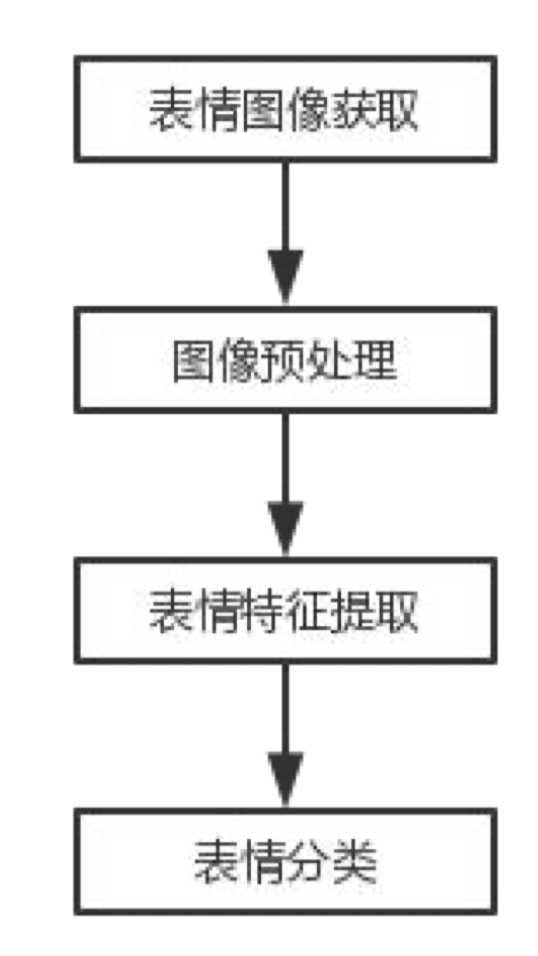

## 图像预处理

人脸表情库是面部表情的标准，它定义了各类表情并有相应表情的图片，供表情识别研究者使用。在此使用的是JAFFE数据库。是由10位日本女性在实 验环境下根据指示做出各种表情，再由照相机拍摄获取的人脸表情图像。整个数据库一共有213张图像，10个人，全部都是女性，每个人做出7种表情，这7种表情分别是：sad、happy、angry、disgust、surprise、fear、neutral。每个人为 一组，每一组都含有7种表情，每种表情大概有3，4张样图。这样每组大概20张样图，图片大小都是256*256。

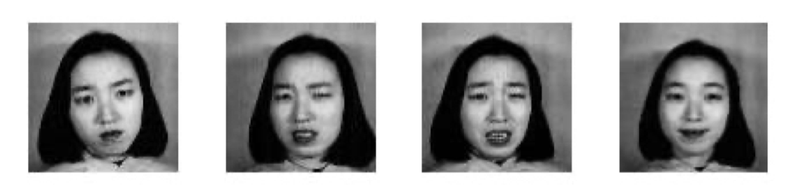

本项目将图片地址存放在list中，之后访问相应的图片，只需要扫描list的值并进行相应文件夹的寻址即可。在最开始图像预处理环节，我将所有的图片都存放在了Database一个文件夹中，并将每个图片的命名进行提取存放在了S.mat表中，在之后进行Gabor小波或PCA特征提取时直接访问S.mat便可获取照片地址，处理好的新照片存放在Gaborbase和Pcabase文件夹中。

本项目采用的主要是利用rgb2grey函数进行图像灰度归一化的处理。

## Gabor小波

因为Gabor特征对干扰因素具备不错的鲁棒性，Gabor特征具有的空间局部性与方向选择性使其能够充分描绘图象的纹理信息。

Gabor变换的实质，是具有窗口可伸缩、核函数频率及带宽可调特性的窗口傅里叶变换。而这种窗口可伸缩、核函数频率及带宽可调的特性与小波变换完全一致，因此又称为Gabor小波变换。Gabor滤波器的频率和方向表达同人类视觉系统类似。经过研究发现， Gabor滤波器其实十分适合纹理表达和分离，生物学上可以很好地近似单细胞的感受函数，所以十分适合进行数据预处理。

Gabor变换定义为：
$$
G_{f}(a, b, w)=\int_{-\infty}^{+\infty} f(t) e^{-i \omega t} d t
$$
其中
$$
g_{a}(t)=\frac{1}{2 \sqrt{\pi a}} \exp \left(-\frac{t^{2}}{4 a}\right)
$$
上式是高斯函数，也可以称之为窗函数。

对于二维 Gabor 的滤波公式，可以表示为以下方式，对于复数表达来说：
$$
g(x, y ; \lambda, \theta, \varphi, \sigma, \gamma)=\exp \left(-\frac{x^{\prime 2}+\gamma^{2} y^{\prime 2}}{2 \sigma^{2}}\right) \exp \left(i\left(2 \pi \frac{x^{\prime}}{\lambda}+\varphi\right)\right)
$$
其含义分别为：

1、波长$\lambda$：它的值以像素为单位指定，通常大于等于2。但不能大于输入图像尺寸的五分之一。通常用的是它的倒数频率$f$大于等于0.2。

2、方向$\theta$：这个参数指定了Gabor函数并行条纹的方向，它的取值为0到360度。

3、相位偏移$\phi$：它的取值范围为-180度到180度。其中，0-180度分别对应中心对称的center-on函数和center-off函数，而-90度和90度对应反对称函数。

4、长宽比$\gamma$：：空间纵横比，决定了Gabor函数形状。

在JAFFE数据库中选取某张图片，倘若大小为140 像素*140像素，在此基础上，构建Gabor滤波器，选取2个尺度及4个方向提取特征：

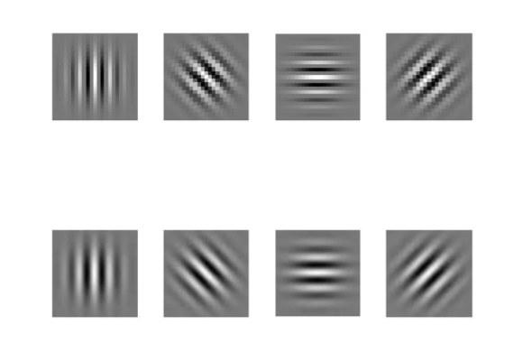

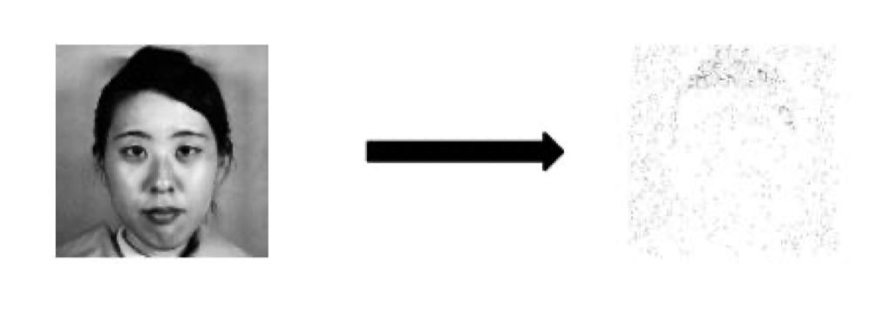

如果假设图象为$M*N$像素，经过四十个滤波器获得的Gabor特征维数可以达到$40*N*M$。故需要降维处理。

## PCA降维处理

PCA的主要方式是将n维特征映射到k维上(k<n)，这k维是全新的正交特征。这k维特征称为主成分，是重新构造出来的k维特征，而不是简单地从n维特征中去除其余n-k维特征。原理在此不再过多介绍，代码讲解部分会在后面介绍。

## ELM极限学习机

极限学习机是一种快速学习算法，在单隐层神经网络，它可以随机初始化输入权重和偏置并得到相应的输出权重。输入神经元是把输入信号给到隐含层。隐含层是由径向基两数或激活函数构成，对输入层的数据通过加权等操作进行计算，其变换为非线性的，节点越少计算越简单。输出层主要是神经网络的输出，通常是隐含层结果的线性叠加。

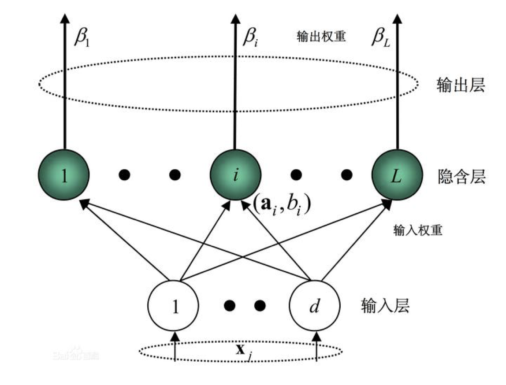

ELM是针对单隐层前馈神经网提出的新算法。含有L个隐含层节点的SLFN的输出表达式为：
$$
f_{L}(x)=\sum_{i=1}^{L} \beta_{i} G\left(a_{i}, b_{i}, x\right)
$$
给定任意$N$个样本，如果含有$L$个隐含节点的SLFN以任意小的误差来逼近这$N$个样本，则存在：
$$
f_{L}\left(x_{j}\right)=\sum_{i=1}^{L} \beta_{i} G\left(a_{i}, b_{i}, x_{j}\right)=t_{j}(j=1, L, N)
$$

上式简化为：
$$
H\beta=T
$$
其中：
$$
H\left(a_{1}, L, a_{N}, b_{1}, L, b_{N}, x_{1}, L, x_{N}\right)=\left[\begin{array}{ccc}
G\left(a_{1}, b_{1}, x_{1}\right) & L & G\left(a_{N}, b_{N}, x_{1}\right) \\
M & L & M \\
G\left(a_{1}, b_{1}, x_{N}\right) & L & G\left(a_{N}, b_{N}, x_{N}\right)
\end{array}\right]_{N \times N}
$$
其中式子里的$H$代表隐含层输出矩阵，$\beta$可以得到如下的解：
$$
\widehat{\beta}=H^+T
$$
以上便是极限学习机的基本算法，通过上述的公式进行计算，便可以进行神经网络的学习。ELM只要调节神经元一个参数，但是准确率和运行时间成反比，而神经元的个数越多，花费时间越多：并且，可以通过调节神经元个数来控制ELM的准确率，刚开始的时候，随着神经元个数增加，准确率上升，一定范围之后，准确率开始下降。

## 代码设计

整个系统的实现主要是基于Matlab实现的，通过上述的各个方法，在代码中有以下几部分，分别是图片预处理与Gabor部分、PCA降维处理部分、极限学习机部分以及最终的GUI设计部分。

### Gabor滤波

在图像处理阶段，首先在我们在最开始将所有图像文件的名程放到了一个mat表中，方便后期的寻址与存储，然后通过imread函数依次获取图片，并利用rgb2grey进行灰度归一化处理，最后调用子函数进行Gabor滤波计算。

通过之前的Gabor滤波公式，对每个图像的的像素点进行计算，在Sx和Sy两个方向进行傅里叶变换，并进行二维卷积计算，从而实现滤波作用。其中在gabor子函数中，I表示输入图像，Sx和Sy是分别沿x和y轴的差额，f表示滤波频率， theta代表滤波方向。

```matlab
...
load S.mat
%h = waitbar(0,'已处理......', 'Name', 'Gabor 特征提取');
steps = length(S); 
for step = 1 : steps
	% waitbar(step/steps,h,sprintf('已处理%d%%',round(step/steps*100))); 
	file = S(step).filename; 
	fileIn = sprintf('Database/%s', file); 
	fileIn = fullfile(pwd, fileIn); 
	Img = imread(fileIn); 
	if ndims(Img) == 3 
		I = rgb2gray(Img); 
	else 
		I = Img; 
	end 
	% 提取 gabor 特征 
	[G,gabout] = gaborfilter(I,2,4,16,pi/3); 
	% 写出特征 
	[pathstr, name, ext] = fileparts(file); 
	fileOut = sprintf('GaborDatabse/%s.jpg', name); 
	fileOut = fullfile(pwd, fileOut); 
	imwrite(gabout, fileOut); 
	S(step).Gfile = fileOut;
end 
...
```

```matlab
...
%循环，并且 sx 向零取整 
for x = -fix(Sx):fix(Sx)
	%循环，并且 sx 向零取整 
	for y = -fix(Sy):fix(Sy) 
		%计算 xPrime 
		xPrime = x * cos(theta) - y * sin(theta); 
		%计算 yPrime 
		yPrime = y * cos(theta) + x * sin(theta); 
		G(fix(Sx)+x+1,fix(Sy)+y+1) = exp(-.5*((xPrime/Sx)^2+(yPrime/Sy)^2))*sin(2*pi*f*xPrime); 
		end
end 
%二维卷积 
Imgabout = conv2(I,double(imag(G)),'same'); 
%二维卷积 
Regabout = conv2(I,double(real(G)),'same'); 
...
```

### PCA降维

先将图片传入，生成样本矩阵，行表示样本的序号，列表示每一个像素点的值，之后计算该矩阵的协方差矩阵及其特征向量，根据特征值的大小进行排序，选取196个最大特征值对应的基向量，将 特征向量组合可以得到变换矩阵base，将原像素矩阵与base相乘便可以得到降维后的矩阵。如图：

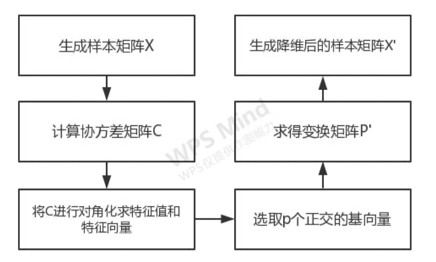

代码如下：

```matlab
%获取所有像素点信息，生成的矩阵行为像素点序号，列为像素点 
allsamples = GetSamples(S); 
%算得均值 
samplemean = mean(allsamples); 
%将中心点平移到原点，简化方差的计算 
xmean = GetStandSample(allsamples, samplemean); 
%计算协方差矩阵 
sigma = xmean'*xmean; 
% 获取特征植及特征向量 
[v, d] = eig(sigma); 
d1 = diag(d); 
%根据特征值大小将特征值矩阵和特征向量矩阵进行排序 
[m,~] = size(d1); 
for i = 1 : m-1
	for j = i : m-1 
		if(d1(j+1,1)>d1(j,1)) 
		v(:,[j,j+1]) = v(:,[j+1,j]); 
		d1([j,j+1],:) = d1([j+1,j],:); 
		end 
	end
end 
vsort = v;
%设定降维后的维度 14*14 = 196
p = 196;
%提取变换矩阵 base = vsort(:,1:p);
```

### ELM神经网络算法

ELM 网络的训练过程非常简单。具体地，在训练之前确定隐含层神经元的个数，随机设定输入层和隐含层间的权值系数以及隐含层的阈值；选择一个合适的激活函数，进而计算隐含层输出矩阵；我们在这里采用的是sin。 最后根据ELM网络期望输出以及隐含层输出矩阵通过求解方程组一次性确定隐含层和输出层间的权值系数。算法学习过程如下：

```matlab
... 
InputWeight=rand(NumberofHiddenNeurons,NumberofInputNeurons)*2-1; 
%%将输入权值系数以及隐含层阈值用随机值初始化 BiasofHiddenNeurons=rand(NumberofHiddenNeurons,1); 
tempH=InputWeight*P; %%使用训练样本输入数据计算隐含层输入 
clear P; 
ind=ones(1,NumberofTrainingData); 
BiasMatrix=BiasofHiddenNeurons(:,ind); 
tempH=tempH+BiasMatrix; %%将隐含层输入减去阈值

%%%%%%%%%%% Calculate hidden neuron output matrix H 
switch lower(ActivationFunction) %%加入激活函数计算隐含层输出 
	case {'sig','sigmoid'} 
		%%%%%%%% Sigmoid 
		H = 1 ./ (1 + exp(-tempH)); 
	case {'sin','sine'} 
		%%%%%%%% Sine 
		H = sin(tempH); 
	case {'hardlim'} 
		%%%%%%%% Hard Limit 
		H = hardlim(tempH); 
		%%%%%%%% More activation functions can be added here
end 
clear tempH;

%%%%%%%%%%% Calculate output weights OutputWeight (beta_i)
OutputWeight=pinv(H') * T'; %%通过期望输出反向计算隐含层到输出层权值系数
end_time_train=cputime; %%获取网络训练结束时间 
TrainingTime=end_time_train-start_time_train; %%计算网络训练时长

%%%%%%%%%%% Calculate the training accuracy 
Y=(H' * OutputWeight)'; %%计算神经网络分类实际值 
if Elm_Type == REGRESSION
	TrainingAccuracy=sqrt(mse(T - Y));
	output=Y; 
end 
clear H; 
...
```

### GUI设计部分

GUI的设计采用的主要是Matlab自带的GUI界面功能，在命令行输入guide即可调出，以按键1为例：

```matlab
...
function pushbutton1_Callback(hObject, eventdata, handles) 
% 获取人脸数据库 
GetDatabase(); 
GaborDatabse(); 
PcaDataBase(); 
S = GetTrainData(); 
Elm_Type = 1; 
NumberofHiddenNeurons = 200; 
ActivationFunction = 'sin'; 
[TrainingTime,TrainingAccuracy] = elm_train(S, Elm_Type, ...
	NumberofHiddenNeurons, ActivationFunction); 
msgbox('程序初始化完毕', '提示信息'); 
...
```

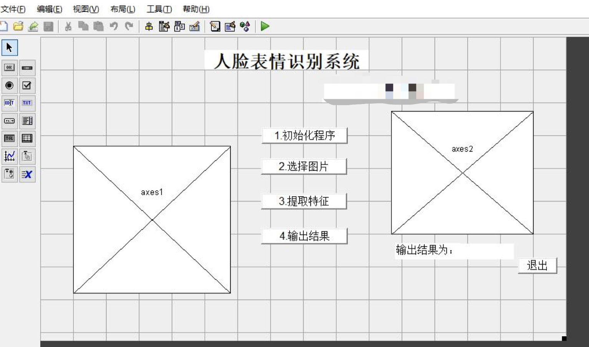

## 结果展示

通过经过上述原理以及代码的完善，最终运行后呈现的GUI界面如图所示：

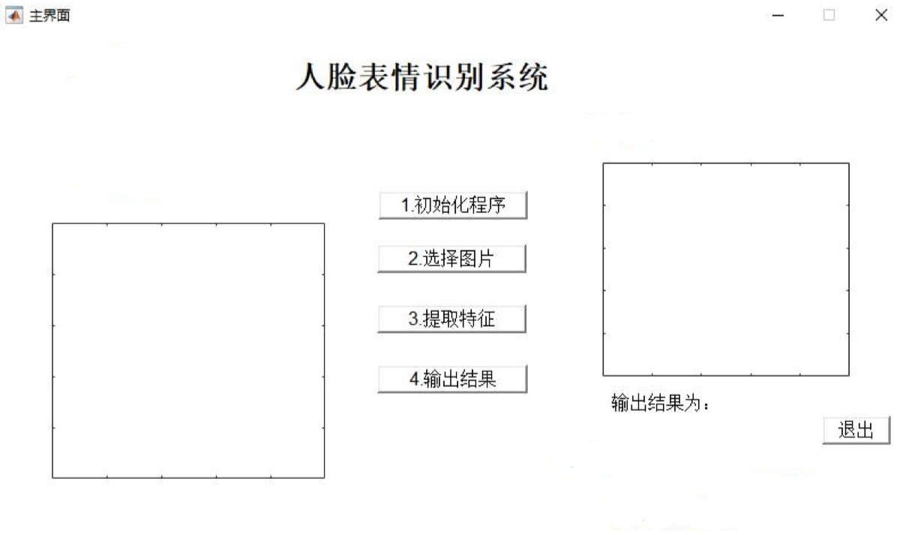

进入界面之后存在两个显示框以及五个按键，左边的显示框为了显示最终的输出矩阵，右边的显示框为了显示单一测试的图片，中间的四个按键是按照顺序分别进行学习与预测的步骤，右下角是退出系统。当我们按下第一步，初始化程序之后，可以得到：

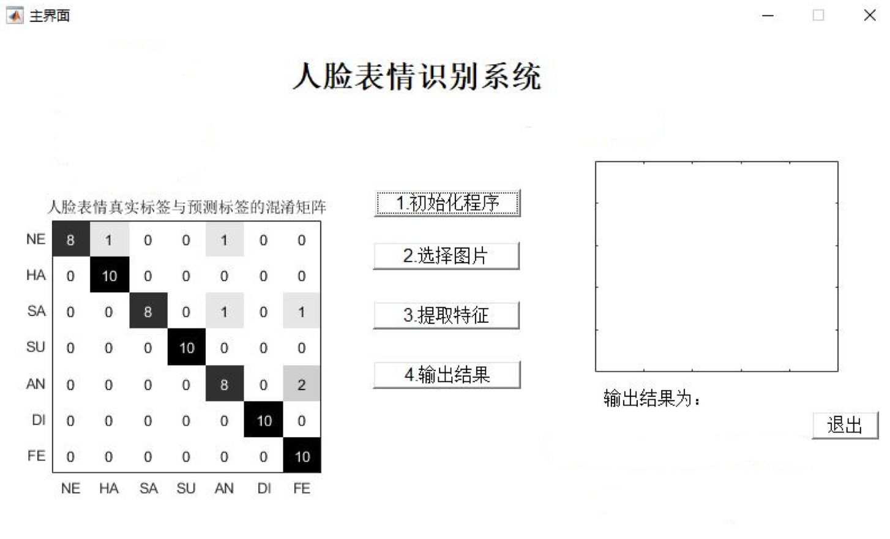

在程序设计中，设计了一个test文件夹，同来存放测试样本的图片，由于实际上的样本数据仅有213张，所以我们将数据中选择了7种表情每个十张，进行了水平翻转处理，如图所示，这样便得到了70张全新的数据照片，可以作为测试样本。

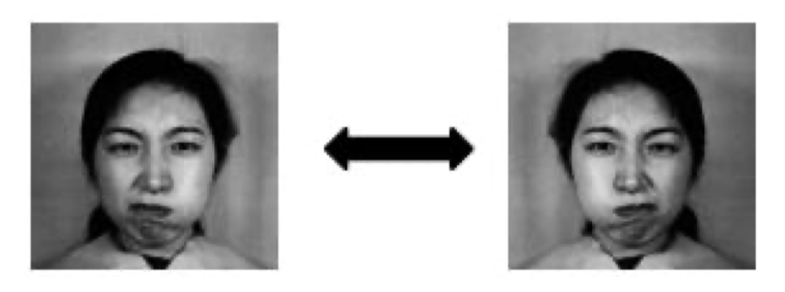

之后便可以通过第二步的按键，进行照片获取，选择一个test文件夹中的图片，便可以得到如图所示：

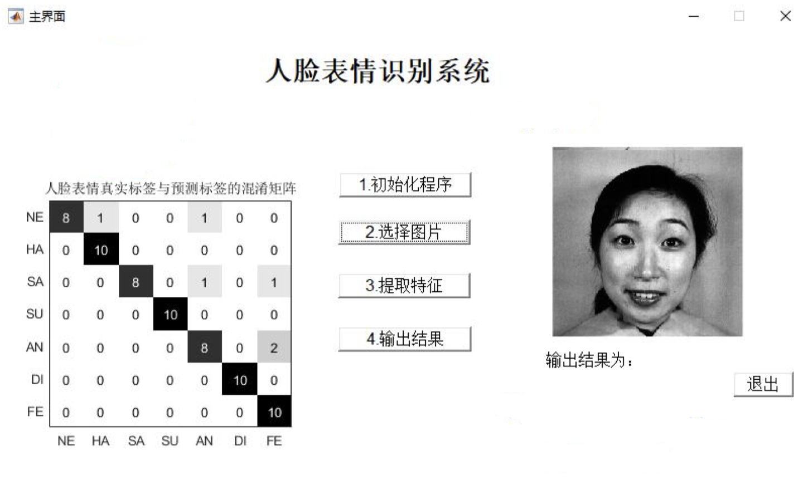

通过图片选择的功能，可以实现在右面的显示界面显示选择单个图片的方式，进行图片选择之后便可以通过第三部进行Gabor特征提取，得到如图所示的图像：

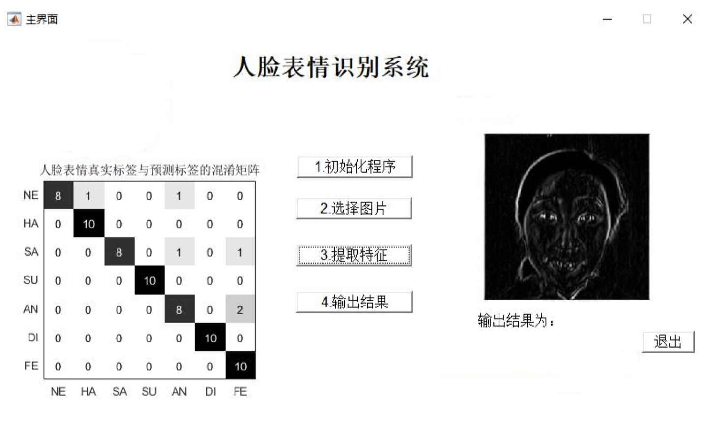

可以发现，经过了第三步之后，图像变得特征更加明显，整个人的轮廓已经提取出来。之后便可以点击最后一个第四步输出结果，得到最终单个图像的表情分类结果，如图所示：

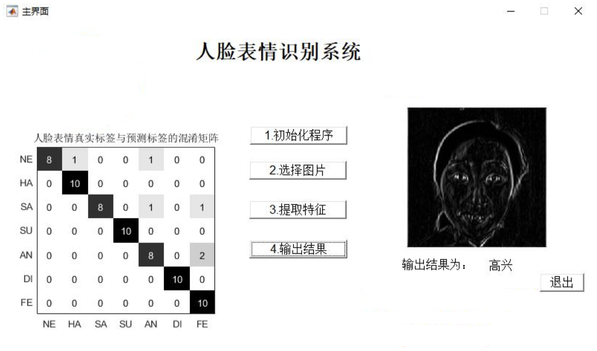

除此之外，也可以用自己的照片进行测试（**彩色照片也可**）：


综上所述，表情测试的结果可以说在误差允许范围内基本实现，对于对比度高的照片来说，运行rgb2grey函数时效果也便更好，测试结果也会更加准确。

## 附录

code：

