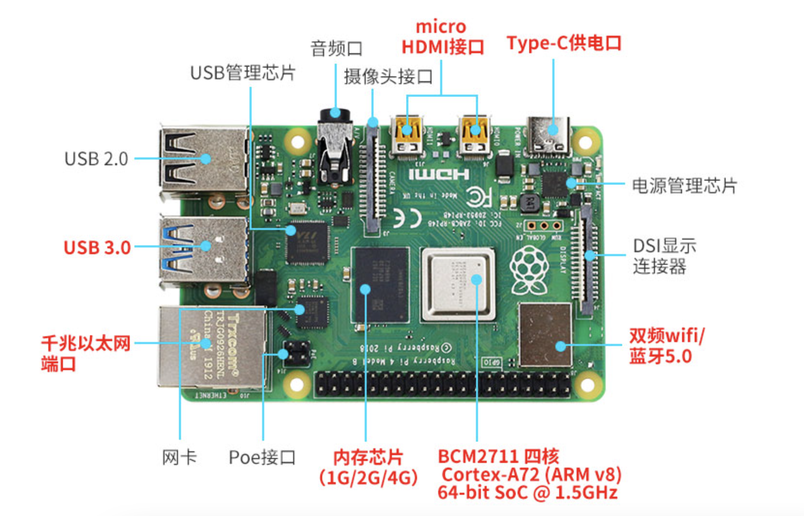
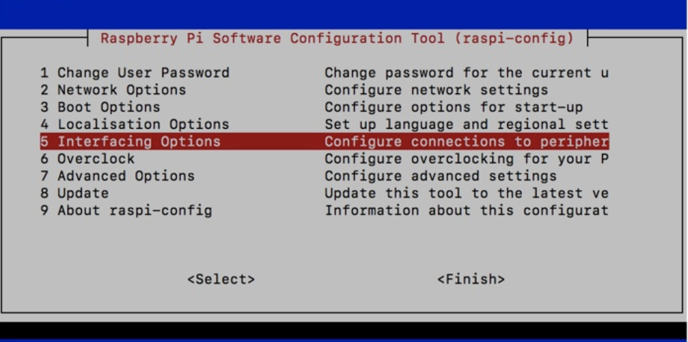
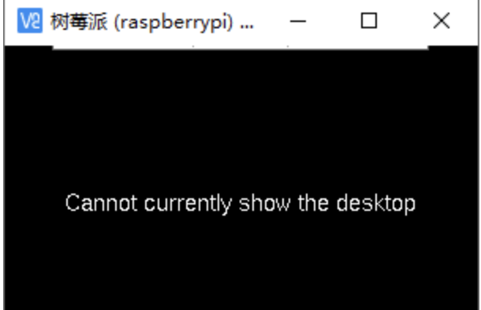
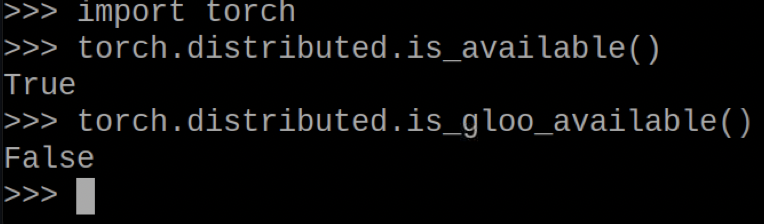
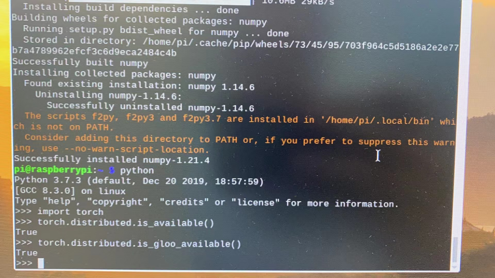

[toc]

**<u>*史上最全树莓派torch配置，转载请务必标明出处！*</u>**有问题可以评论或私信。需要wheel文件的评论区留邮箱或者私信。

最近有个工程需要利用多个树莓派实现分布式环境的搭建，可算是折腾死我了（在此吐槽arm架构）。所以总结了这篇关于树莓派深度学习环境（pytorch）的配置，也算是总结下踩过的坑。文章章节安排如下：

一、树莓派32位系统下的torch安装

目前树莓派官网给到的都是32位系统，但不得不说时代在进步，一些新兴的torch下的包已经对32位不支持了，如果你需要用到的库32位下支持，可以看这部分，如果不支持按照第四部分安装64位环境下的torch。当然，此部分还涉及许多基本配置（SSH、VNC、python），需要的可以食用。

二、终端配置代理

这部分只是针对git实现的一个代理操作，有其他方式代替的可以直接跳过，与torch无关。

三、源码编译32位系统

此部分是由于网上下载的资源并不能实现我所需要的分布式环境（即torch下的distributed.gloo），所以自己编译了一遍（虽然最后还是没成功），不过此方式是我比较推荐的，毕竟自己编译一遍比用别人的心里有底。

四、树莓派64位系统下的torch安装

不必多言，64位yyds！


# 一、树莓派相关配置与32位系统下torch安装

本章节涉及到的相关烧录软件网上百度一大片，我就默认你们烧系统都会了，在此不再过多介绍。

## 1、外壳风扇



- 风扇安装


风扇螺丝不可拧的太紧，否则会导致风扇堵转损坏

---


## 2、烧录系统

1. 将SD卡格式化，用软件SDFormat
2. 利用烧录软件Win32Diskimager将系统烧录到SD卡中

> 树莓派4B+的芯片为arm的。对应的torch属于arm7l。输入 ``uname -a`` 查看。

若是新手级别的系统，则自带ssh，若是官网的系统，烧录完毕后，需进行以下操作，方可开启ssh：

- windows烧录完毕后，在boot文件夹（目前应该只省了200m左右的位置了，其余的linux磁盘分区在win上不可见）新建一个空的ssh文件夹，方法：

1. 打开cmd，输入``E:``。（具体看要建的盘是哪一个，有可能是F、H）
2. 输入 ``cd.>ssh`` 回车。

---


## 3、远程SSH连接

我拿到的树莓派因为当时没有屏幕，所以愁坏了我，好在有网线可以把树莓派和我的笔记本通过局域网连起来，于是采用了这样的方法。

我是直接在mac下的终端实现的，因为自带ssh，win系统可以百度“无屏幕访问树莓派ssh”。

```bash
(base) qitianyu@qitianyudeMacBook-Pro ~ % ping raspberrypi.local
PING raspberrypi.local (10.1.82.101): 56 data bytes
64 bytes from 10.1.82.101: icmp_seq=0 ttl=64 time=0.779 ms
64 bytes from 10.1.82.101: icmp_seq=1 ttl=64 time=0.631 ms
64 bytes from 10.1.82.101: icmp_seq=2 ttl=64 time=0.739 ms
^C
--- raspberrypi.local ping statistics ---
3 packets transmitted, 3 packets received, 0.0% packet loss
round-trip min/avg/max/stddev = 0.631/0.716/0.779/0.063 ms
(base) qitianyu@qitianyudeMacBook-Pro ~ % ssh pi@10.1.82.101    
pi@10.1.82.101's password: 
Linux raspberrypi 5.10.63-v7l+ #1459 SMP Wed Oct 6 16:41:57 BST 2021 armv7l

The programs included with the Debian GNU/Linux system are free software;
the exact distribution terms for each program are described in the
individual files in /usr/share/doc/*/copyright.

Debian GNU/Linux comes with ABSOLUTELY NO WARRANTY, to the extent
permitted by applicable law.
Last login: Tue Nov 30 11:12:32 2021 from 10.1.80.235
pi@raspberrypi:~ $ ls
Bookshelf  Documents  Music   opencv_contrib  Public     Videos
Desktop    Downloads  opencv  Pictures        Templates  Yahboom_Project
```

1. 找到pi的ip地址，利用``ping raspberrypi.local``。
2. ssh连接，``ssh pi@x.x.x.x``，**<u>*用户名都是pi，新手级别的系统本机密码是yahboom，官网系统的密码是raspberry。*</u>**

第一次新建ssh空文件后连接有可能出现如下问题：

```shell
(base) qitianyu@qitianyudeMacBook-Pro ~ % ssh pi@10.1.83.185
@@@@@@@@@@@@@@@@@@@@@@@@@@@@@@@@@@@@@@@@@@@@@@@@@@@@@@@@@@@
@    WARNING: REMOTE HOST IDENTIFICATION HAS CHANGED!     @
@@@@@@@@@@@@@@@@@@@@@@@@@@@@@@@@@@@@@@@@@@@@@@@@@@@@@@@@@@@
IT IS POSSIBLE THAT SOMEONE IS DOING SOMETHING NASTY!
Someone could be eavesdropping on you right now (man-in-the-middle attack)!
It is also possible that a host key has just been changed.
The fingerprint for the ECDSA key sent by the remote host is
SHA256:UIlXVGTUEoUUD/LCqB3ADnqPXF19I4vgbkbAoMZVQ6k.
Please contact your system administrator.
Add correct host key in /Users/qitianyu/.ssh/known_hosts to get rid of this message.
Offending ECDSA key in /Users/qitianyu/.ssh/known_hosts:3
ECDSA host key for 10.1.83.185 has changed and you have requested strict checking.
Host key verification failed.
```

此时只需要执行

```shell
ssh-keygen -R x.x.x.x
```

然后再执行一遍``ssh pi@x.x.x.x``即可。

---


## 4、配置VCN远程连接图形化界面

- 终端输入进入到配置界面

```shell
sudo raspi-config
```

- 按照Interface Options -> VNC -> Yes的顺序依次操作，最终会打开VNC。



- 在win或mac上安装 [RealVNC Viewer](https://www.realvnc.com/en/connect/download/viewer/)，输入正确地ip地址即可连接。

> 在成功连接后有可能遇到无法正常显示的情况：
>
> 
>
> 这是由于分辨率的原因，可以按照以下步骤配置：
>
> - 命令行输入``sudo raspi-config``。
> - 选择Display Options > Resolution，（这里的Resolution也有可能在Advanced Options选项中）修改一个除了Default以外的分辨率。
> - 回车确定后，**<u>按方向右键选择finish，重启（reboot）树莓派！！</u>**
>
> 即可在VNC中正常显示了。


## 5、安装python3.7

这部分适用于32位系统和64位系统，因为3.7适用于我的工作，需要更高版本的改一下版本号就好了。

- 安装依赖包

```shell
sudo apt-get install -y make build-essential libssl-dev zlib1g-dev   
sudo apt-get install -y libbz2-dev libreadline-dev libsqlite3-dev wget curl llvm 
sudo apt-get install -y libncurses5-dev  libncursesw5-dev xz-utils tk-dev
```

- 从[Python网页](https://www.python.org/ftp/python/)中找到相应的版本，点击下载。

```shell
sudo wget https://www.python.org/ftp/python/3.7.3/Python-3.7.3.tgz
```

- 解压

```shell
sudo tar -zxvf Python-3.7.3.tgz
```

- 解压结束 进入生成的目录

```shell
cd Python-3.7.3
```

- 安装python

```shell
sudo ./configure --prefix=/usr/local/python3
sudo make
```

- 将默认python2切换到python3。先进行查看python

```shell
whereis  python
```

如果有带着2的，也有带着3的版本python则是正确的。目前用``python``进入到python2中，用``python3``进入到python3.7中。

- 将python的链接删了

```shell
sudo rm /usr/bin/python
```

- 将python3软链接上去

```shell
sudo ln -s /usr/bin/python3.7 /usr/bin/python
```

则python进去就是python3.7了，pip的话用``pip3``即可

---


## 6、安装pytorch1.6

在网上找到了相应的资源，提供了arm7l版的pytorch的.whl资源，故采用此方式。相应的资源网上搜索会有很多，当时下载的连接我也找不到了，需要的可以评论区。

- 将下载好的torch-1.6.0和torchvision-0.8.0两个文件传输到树莓派。
- 安装必要的依赖包

```shell
sudo apt-get install libopenblas-dev
```

- 安装numpy （没有numpy的话也能成功编译，但是编译出来的PyTorch不支持numpy）

```shell
pip3 install numpy pyyaml
```

或者通过：

```shell
pip3 install -i https://mirrors.aliyun.com/pypi/simple numpy pyyaml
```

- 进入到存放好的torch和torchvision的文件夹，安装torch

```shell
ls
```

- 安装torchvision

```shell
pip3 install torchvision-0.8.0a0+10d5a55-cp37-cp37m-linux_armv7l.whl
```

- 测试

```python
import torch
a=torch.rand(5,3)# torch.rand返回服从均匀分布的初始化后的tenosr，外形是其参数size。
print(torch.__version__)
```

大功告成！

然而实际的情况是，我需要用到的torch下的gloo并没有大功告成。



猜测原因是网上下载的wheel文件把distributed禁用了。如果你不需要用到这部分功能，至此完全是可以胜任了。或者不放心的话，可以移步第三章自行编译一遍。

---


# 二、Mac下终端配置代理

## 1、配置代理

运行并打开，可以得到sockets5的代理端口。我这里是1090。

## 2、配置mac的shell代理文件

- 首先编辑配置文件

```shell
vim ~/.bash_profile
```

- 在配置文件下添加如下内容（目前已经添加好）：

```shell
function proxy_off(){
        unset http_proxy
                unset https_proxy
                echo -e "已关闭代理"
}

function proxy_on() {
                proxyopen
                export http_proxy="http://127.0.0.1:1090"
                export https_proxy=$http_proxy
                echo -e "已开启代理"
}
```

- 每打开一个新终端，将panda调为自动代理脚本模式，并激活：

```shell
source  ~/.bash_profile
```

- 输入``proxy_on``打开代理，（此刻可以连接外网啦），输入``proxy_off``关闭代理。**仅限当前终端下！**

由于树莓派是32位的，32位arm架构的代理俺不会配，所以采用曲线救国的方式，在笔记本上git好torch的源码，分支啥的都选好，然后直接u盘拷给树莓派直接make，如果有更好的方法教教我。

---


# 三、源码编译torch

按照第二章所说的，我是在本地git下来，调整好分支再用u盘拷过去的，具体方式如下：

## 1、本地克隆torch源码

- 在本地执行：

```shell
git clone --recursive https://github.com/pytorch/pytorch
```

这里的``--recursive``是循环克隆的意思，其原理就是把源码下所有会用到的其他github库clone下来，所以在此步骤采用添加镜像方式的话（如利用github.com.cnpmjs.org），只是本项目镜像拉取，循环克隆阶段还是会很慢，（很烦！！！），这也是我为啥在上一章一定要配个代理的原因。

- 调整分支：

```shell
git checkout v1.6.0
git submodule update --init  --recursive
```

在编译过程中，在54%的时候我还遇到了这个问题：

```shell
subprocess.CalledProcessError: Command '['cmake', '--build', '.', '--target', 'install', '--config', 'Release', '--', '-j', '4']' returned non-zero exit status 2.
```

这是因为在很多其他的博文中，说一定要添加``git submodule update --remote third_party/protobuf``，在此我想说：千万别！这句话可害惨了我，原因是protobuf这个包在之前存在bug，所以要获取更之前的分支，但现在这个bug已经修复好了，如果执行这句话反而会报错（血的教训）。

至此在笔记本本地的源码git拉取操作完毕了，可以把这个工程拷到u盘里让它静静等待一会。

## 2、树莓派相关配置

- 调整树莓派交换内存：

```shell
sudo dphys-swapfile swapoff  #关闭交换内存
sudo vim /etc/dphys-swapfile   #修改配置文件
```

将其中的CONF_SWAPSIZE和后面注释掉的CONF_MAXSWAP都设置为4096即可。

```shell
sudo service dphys-swapfile restart
```

或者通过：

```shell
sudo dphys-swapfile swapon
```

可以通过``free -m``查看swap情况，若还是没有可以通过``reboot``重启。

- 添加依赖项：

```shell
sudo apt install libopenblas-dev libblas-dev m4 cmake cython python3-yaml libatlas-base-dev

sudo apt-get install cython3 libatlas-base-dev m4 libblas-dev cmake

sudo apt-get install python3-dev python3-setuptools python3-wheel python3-pillow python3-numpy
```

对于树莓派4，可能在编译过程中遇到问题，（我是没遇见），可以执行以下以修改gcc版本：

```
sudo apt-get install gcc-4.9 g++-4.9
```

- 设置环境变量，测验证明，32位下的torch就都这么设置吧，不能用的是真用不了。

```shell
export NO_CUDA=1
export NO_DISTRIBUTED=1   #为了使distibuted下的gloo可用，没加这句，但貌似还是不行
export NO_MKLDNN=1
export NO_NNPACK=1
export NO_QNNPACK=1
export MAX_JOBS=4   #这里设置4是因为4b是4核，如果树莓派是3的话，设置成1
```

## 3、编译torch源码

- 首先将u盘里已经暖热乎的torch工程拷到树莓派中，然后cd到相关文件夹，执行：

```shell
python3 setup.py build
```

这一步时间很长，我的是树莓派4B+，大概用了三个多小时吧，如果是树莓派3的话时间翻倍，但请务必忍一忍，都到这一步了，很快就实现了。

- 当出现no longer necessary to use ‘build’ or 'rebuild’的字样就是编译成功啦！恭喜，然后是最后一步：

```shell
sudo su
```

如果不执行这一步，会报错说我们没有权限把torch写入site-packages文件夹内，如果你没有特地设置，这一步树莓派是不要求密码的。接着再执行：

```shell
python3 setup.py install
```

至此，torch就彻底安装成功了，当然也可以通过以下指令打包成轮子文件：

```shell
python3 setup.py bdist_wheel
```

这样将build一个wheel文件，保存在`pytorch/dist`中

```shell
cd dist
pip3 install ./torch-1.6.0-xxx_linux_armv71.whl
```

这样安装也可以滴！

## 4、测试环节

测试的时候也出了一点点小bug，具体测试方法不用再多说了，但注意千万不要在torch的源码文件夹内``python3``进入，一定要``cd``出来，可以到home目录下执行，不然执行``import torch``时候会出问题，这个错误我当时还查了好半天。

## 5、安装torchvision

与torch的安装类似，直接执行：

```shell
git clone https://github.com/pytorch/vision.git
pip3 install pillow
cd vision
git checkout v0.7.0-rc4	# pytorch 1.6 对应 torchvision 0.7
git submodule update --init --recursive
python3 setup.py bdist_wheel
```

此时有可能发生如下的错误：

```shell
/home/pi/Pytorch/vision/torchvision/csrc/cpu/decoder/defs.h:12:10: fatal error: libavcodec/avcodec.h: 没有 那个文件或目录
#include <libavcodec/avcodec.h>
       ^~~~~~~~~~~~~~~~~~~~~~
compilation terminated.
error: command 'arm-linux-gnueabihf-gcc' failed with exit status 1
```

这时候将``setup.py``中的第178行``if has_ffmpeg``改为``if False``即可。

最后再：

```shell
pip3 install torchvision-0.7.0a0+78ed10c-cp37-cp37m-linux_armv7l.whl
```

# 四、在64位系统下torch安装

虽然我已经在上面尝试了太多种方法安装torch，但最后都是没能解决我的致命问题——实现gloo分布式。最后在一篇解答中找到了原因：


得嘞！前面功夫全白费了，看来人家32位系统就是不支持gloo，没办法，从头开始吧，首先是寻找64位系统。

## 1、树莓派的64位系统

树莓派4B性能强劲，早就有许多大神做了一些64位系统，但树莓派官网上提供的都是32位系统（不懂为啥），很多小伙伴以为就没有官方的64位系统了，其实查阅了很多博文后发现，其实是有的，只是被隐藏起来了而已，具体的地址：[树莓派官方64位系统地址](https://downloads.raspberrypi.org/raspios_arm64/images/)

下载好相应的系统之后，按照第一章说的烧录即可。

## 2、python3安装

同第一章，不再多说

## 3、torch和torchvision安装

这里我并没有再自行编译，而是找到了一个大神的神一般的仓库：[64位torch安装wheel文件合集](https://torch.kmtea.eu/whl/stable.html)

在网站中找到所需版本的torch和torchvision文件，拷到树莓派上，``cd``到相应文件夹，直接执行：

```
pip3 install ****
```

如果还出现问题的话，那就直接用第三章的办法源码编译吧，虽然我没有试过但我感觉应该不会出什么太大问题（毕竟arm64用的人还是比较多的，出了问题也好解决）。

至此，我的分布式gloo环境总算是配好了：



呜呜呜呜呜太不易了！

总而言之这次的环境配置之路可谓是一波三折，但最终结果总归是好的。这种环境配置就是这样，执行一步命令，以为终于可以了，吃着火锅唱着歌，咔嚓就给你来个报错，所以还是不要高兴得太早，凡事一步一步来，问题一个一个解决。最后感谢一下进度慢到爆都不push我的导师和师兄，你们人真好，好人有好报。

关于本文，欢迎大家批评、建议、抬杠、纠正，如果有用的话欢迎大家收藏点赞，需要本文任何系统、文件、软件的随时找我，回复会迟到但不会不到，大家一同学习一同进步。