# Resource-Efficient Federated Learning with Hierarchical Aggregation in Edge Computing

[toc]

## Abstract

现有的边缘计算FL可能会导致训练时间过长，增加沟通资源的开销。本文提出了通过将边缘节点划分为$K$个簇，集群中的边缘节点通过同步方法将本地更新转发到报头上，所有集群报头再异步更新聚合。以上成为分层聚合，收敛界限取决于簇的个数和训练时间。我们定义了资源高效的分层聚合问题（RFL-HA），通过算法来约束最优集群结构（$K$的最优值）。

---

## Introduction

原本的FL边缘计算工作是基于parameter server和workers的，但上述方法存在一定的弊端：1）PS位于远程云平台上，边缘节点与远程服务器之间的通信经常不可用。2）在MEC中资源（通信和计算）是有限的。3）：模型的大小很大。4）：边缘节点的数量庞大。

本文的目标，<u>是减少边缘节点和PS之间的通信，加强边缘节点之间的协作</u>。

首先将边缘节点分为$K$个簇，选择一个leader node（LN）作为集群头，集群内部采取同步通信，LN和PS的通信采取异步通信。训练性能主要取决于集群拓扑和资源预算，所以如何将这些边缘节点组织成簇$K$就十分重要。

**<u>贡献</u>**：

1、设计了一种新的基于簇的FL机制，实现了层次聚合。分析了集群数和训练时间的收敛范围。

2、定义了具有层次聚合的资源高效联合学习（RFL-HA）问题，提出了一种确定资源约束条件下K值最优值的有效算法。还拓展到了动态场景，通过重新聚类边缘节点。

3、做了仿真实验

---

## Preliminaries

回顾先前工作，提出本文的机制，证明其收敛性。

### A、联邦学习

传统的FL都是采用的同步聚合，所以每个epoch的进展速度都和最慢的边缘节点的速度一样快。因此我们采用异步FL，当PS从任意worker收集到本地更新时，就执行全局聚合。但通过该方法需要更多的训练时间才能达到相应的精度，而且由于基于PS的2层架构，上述工作将消耗更多的通信资源。

### B、基于梯度下降的FL

设$j$为一个训练样本，包括特征$x_j$和标签$y_j$，对于logistic回归或者CNN损失函数可以定义为$f_j(w,x_j,y_j)$，其中$w$代表模型参数，在数据$D$中的损失函数可以写为：
$$
f(w)=\frac{1}{|D|} \sum_{j \in D} f_{j}(w)
$$
即问题描述为寻找使损失函数最小的最优模型参数：
$$
w^{*}=\arg \min f(w)
$$
直接求解是不可能的，所以一般采用梯度下降的方式，逐渐接近最优解，即：
$$
w(t)=w(t-1)-\eta \nabla f(w(t))
$$

### C、基于集群的联邦学习

我们引入了基于簇的FL机制。假设有$N$个边节点，边节点被分成$K$个簇，每个簇$k$中有$n_k$个边节点。每个边缘节点$i$具备特征向量$V_i$，从通信开销（时延），模型训练能力（计算能力，数据集大小）中提取。将$V_i$转发给PS后出发聚类操作。我们将每个区域的节点根据成本划分一个集群，之后每个区域的节点将进一步划分为几个小簇。

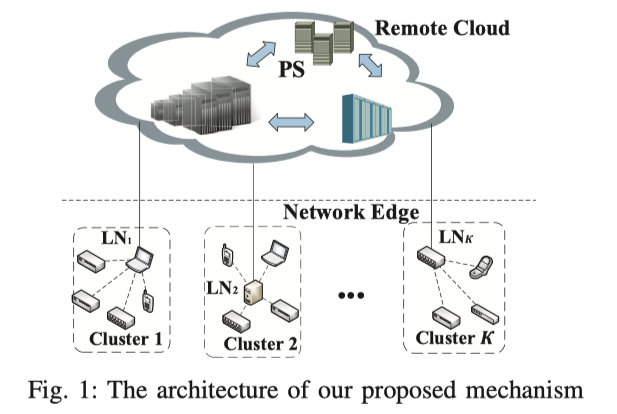

为了避免出现$n_k=0$的情况，我们采取了常见的平衡聚类方法（k-means，FSCL），使得均方误差最小，从而平衡聚类方法。该方式平衡了每个集群中边缘节点的数量差异，即$n_{k} \rightarrow\left\lfloor\frac{N}{\mathcal{K}}\right\rfloor+\beta_{k}$，其中$\beta_k\in\{0,1\}$，整个聚类过程由PS完成，然后PS简单的根据特征向量选择$K$中具有强大的计算和通信能力的节点$LN_k$。

聚类结束后，在集群$k$中的边缘节点$i$开始用它的数据集$D_k^i$开始训练模型$w_k^i$，损失函数为：
$$
F_{k}^{i}\left(w_{k}^{i}\right)=\frac{1}{\left|D_{k}^{i}\right|} \sum_{j \in D_{k}^{i}} f_{j}\left(w_{k}^{i}\right)
$$
假设总共有$T$轮训练，**<u>每个epoch有且仅有一个全局聚合</u>**，设$H$次更新后把模型传递给边缘节点的$LN_k$，一旦收集全所有的集群$k$中的节点模型，便会更新该集群的整体模型（根据数据量加权平均了一下）：
$$
w_{k}=\frac{\sum_{i=1}^{n_{k}}\left|D_{k}^{i}\right| w_{k}^{i}}{\sum_{i=1}^{n_{k}}\left|D_{k}^{i}\right|}
$$
将此模型传递给PS，再用下一节的方法进行全局聚合。全局的损失函数定义为：
$$
F\left(w^{t}\right)=\frac{\sum_{k=1}^{\mathcal{K}} \sum_{i=1}^{n_{k}}\left|D_{k}^{i}\right| F_{k}^{i}\left(w^{t}\right)}{\sum_{k=1}^{\mathcal{K}} \sum_{i=1}^{n_{k}}\left|D_{k}^{i}\right|}
$$
由此可见，如果PS不将全局模型共享给所有边缘节点，则不能直接计算全局损失函数。

我们提出的FL机制是对以前FL解决方案的推广，如果$K$为1，则变为同步FL，如果$K$为$N$则正好是异步FL。

### D、Staleness-aware全局更新

由于每个簇中的边缘节点执行同步FL方法，其陈旧程度相同，记为$\tau$，对于集群$k$它的陈旧性被定义为自上次全局更新后经历的epoch数量。全局模型的更新由陈旧度决定：
$$
w^{t}=\left(1-\alpha_{\tau}^{t}\right) w^{t-1}+\alpha_{\tau}^{t} w_{k}
$$
其中$\alpha_{\tau}^t$是权重$w_k$在epoch为$t$的时候并存在陈旧度为$\tau$的值。定义为：
$$
\alpha_{\tau}^{t}= \begin{cases}\alpha, & \tau \leq a \\ \alpha \cdot \tau^{-b}, & \tau>a\end{cases}
$$
其中$a>0,b\geq 0$，$\alpha$是一个初始值范围是$(0,1)$。所以当$\tau >a$时，模型的权值会随着陈旧度的增大而迅速下降，而实际上，将边缘节点划分为不同数量的集群时，<u>每个集群的模型权值会随着集群数量的增加而下降</u>。我们初始化$\alpha$为：
$$
\alpha=\phi(\mathcal{K})=1-\frac{\mathcal{K}-1}{N} \quad \mathcal{K} \in \{1,...,N\}
$$
所以上式可以变为：
$$
\alpha_{\tau}^{t}= \begin{cases}1-\frac{\mathcal{K}-1}{N}, & \tau \leq a \\ \left(1-\frac{\mathcal{K}-1}{N}\right) \tau^{-b}, & \tau>a\end{cases}
$$

### E、收敛性分析

假设损失函数都是强凸函数且光滑的。对于许多具有凸损失函数的模型，如线性回归、LR和SVM，都可以满足上述假设。所以我们先分析了H局部更新后的收敛界。在此基础上，我们将推导出T次epoch之后的界。

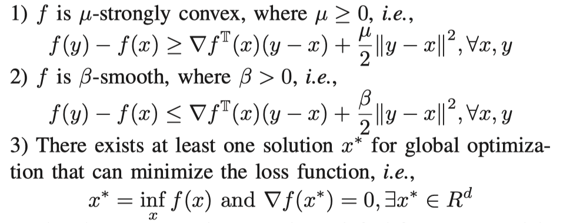

我们存在两种约束范围$Q_1$和$Q_2$。定义为：
$$
\mathbb{E}\|\nabla f(w ; j)-\nabla F(w)\|^{2} \leq Q_{1}
$$

$$
\mathbb{E}\|\nabla f(w ; j)\|^{2} \leq Q_{2}
$$

根据以前的工作我们可以得到一个性质，任意聚类$k$中的边缘点$i$通过模型$w^{t-\tau}$进行$H$局部更新后，收敛界为：
$$
\begin{aligned}\mathbb{E}\left[F\left(w^{t-\tau, H}\right)-F\left(w^{*}\right)\right] \leq(1-\eta \mu)^{H}\left[F\left(w^{t-\tau, 0}\right)-F\left(w^{*}\right)\right]+\frac{H \eta Q_{1}}{2}
\end{aligned}
$$
其中$w^{t- \tau,H}$表示模型$w^{t- \tau}$经过了$H$次epoch，在本方法中，集群中的节点同步更新完后，便立刻开始执行异步更新，因此在$t$次epoch之后存在：

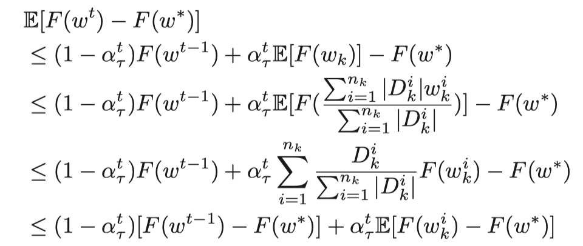

最终结合上面两式得到收敛界限（**定理1**）：
$$
\begin{aligned}
\mathbb{E}\left[F\left(w^{T}\right)-F\left(w^{*}\right)\right]\leq\left[\frac{\mathcal{K}-1}{N}+\alpha(1-\eta \mu)^{H}\right]^{T}\left(F\left(w^{0}\right)-F\left(w^{*}\right)\right) \\+\frac{\left(Q_{1}+Q_{2}\right)\left(1-\left[\frac{\mathcal{K}-1}{N}+\alpha(1-\eta \mu)^{H}\right]^{T}\right)}{2 \eta \mu^{2}}
\end{aligned}
$$

### F、问题公式化

我们给出了具有层次的联邦学习的资源高效问题的定义（RFL-HA）。对于特定的ML任务，我们将确定在资源一定的约束下用于训练的最优聚类数$\mathcal{K}$。资源约束存在多种（计算资源、通信资源。。。），在此定义$M$种不同类型的资源，每个资源$m \in \{1,...,M\}$的预算为$R_m$，我们假设在每$H$次聚合中对于$m$资源的消耗为$c_m$，设$b_m$为边缘节点全局聚合时的资源消耗，则$T$个epoch之后的总消耗为：
$$
T \cdot n_{k} \cdot p_{k}^{t} \cdot\left(c_{m}+b_{m}\right)
$$
其中$p_k^t$为二进制变量用来判断在$t$次epoch之内是否有全局聚合，由于全局聚合时异步的所以$p_k^t$是实时确定的，那么RFL-HA表示为：

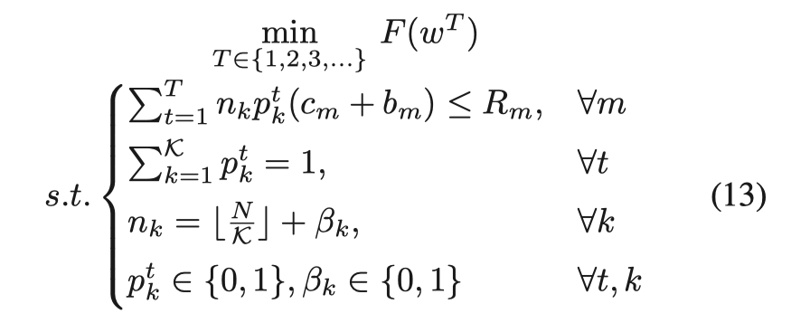

整体思路是先求$K$值再由$K$值导出$T$。

---

## CLUSTER - BASED ALGORITHM FOR FL

### A、RFL-HA的近似解

我们先研究了静态情况下的近似解（稳定的网络带宽，足够的功率和近似解），我们用$F(w^T)-F(w^*)$代替原本的$F(w^T)$，并用上一节的收敛范围替换掉，上式13的第3个不等式也可以相应的替换掉一个变量，表示为：

其中$\gamma$是一个和$T$和$K$相关的式子。$T$越大则14中的目标函数越小。在此利用第一个约束取$T$的值为：$\min _{m} \frac{R_{m}}{\left.T \frac{N}{K}\right\rceil\left(c_{m}+b_{m}\right)}$，我们带入14中的目标函数可得：
$$
\begin{aligned}
L(\mathcal{K}) &=\left[\frac{\mathcal{K}-1}{N}+\alpha(1-\eta \mu)^{H}\right] \frac{R_{m} \mathcal{K}}{N\left(c_{m}+b_{m}\right)}\left[F\left(w^{0}\right)-F\left(w^{*}\right)\right] \\
&+\frac{\left(Q_{1}+Q_{2}\right)\left[1-\left(\frac{\mathcal{K}-1}{N}+\alpha(1-\eta \mu)^{H}\right)^{\frac{R_{m} \mathcal{K}}{N\left(c_{m}+b_{m}\right)}}\right]}{2 \eta \mu^{2}}
\end{aligned}
$$
之后便可以确定$K$的最优值为：
$$
\mathcal{K}^{*}=\arg \min _{\mathcal{K} \in\{1,2, \ldots, N\}} L(\mathcal{K})
$$
我们还存在**定理2**：当$R_{min}=minR_m$时，如果$R_{min}\rightarrow \infty$，我们存在$F\left(w^{T}\right)-F\left(w^{*}\right) \leq \frac{Q_{1}+Q_{2}}{2 \eta \mu^{2}}$.

证明：由以上约束不难得出$T=(\min _{m} \frac{R_{m} \mathcal{K}}{N\left(c_{m}+b_{m}\right)}) \rightarrow \infty$，还存在$\frac{\mathcal{K}-1}{N}+\alpha(1-\eta\mu)^H<1$。所以存在$(\frac{\mathcal{K}-1}{N}+\alpha(1-\eta\mu)^H)^T \rightarrow0$。结合定理1即可证明。这一结果表明，若没有资源约束，则无论$K$的取值范围如何，模型终会收敛。

所以在此我们需要学习资源约束下的情况。我们设置：
$$
g(\mathcal{K})=\left[1-\left(\frac{\mathcal{K}-1}{N}+\alpha(1-\eta \mu)^{H}\right)^{\frac{R_{m} \mathcal{K}}{N\left(c_{m}+b_{m}\right)}}\right]
$$
我们令：
$$
A=\frac{1}{N}\left(1-(1-\eta \mu)^{H}\right), B=\frac{R_{m}}{N\left(c_{m}+b_{m}\right)}
$$
则$g(\mathcal{K})$可以化为：
$$
g(\mathcal{K})=(1+\mathcal{K} A-(N+1) A)^{\mathcal{K} B}
$$
求导可以得到：
$$
\begin{aligned}
\frac{\partial g(\mathcal{K})}{\partial \mathcal{K}}=&(1+\mathcal{K} A-(N+1) A)^{\mathcal{K} B}[B \ln (1+\mathcal{K} A-(N+1) A)\\
&\left.+\frac{\mathcal{K} B A}{1+\mathcal{K} A-(N+1) A}\right]
\end{aligned}
$$
二阶导为：
$$
\begin{aligned}
&\frac{\partial^{2} g(\mathcal{K})}{\partial^{2} \mathcal{K}}=(1+\mathcal{K} A-(N+1) A)^{\mathcal{K} B}[B \ln (1+\mathcal{K} A-(N+1) A) \\
&\left.+\frac{\mathcal{K} B A}{1+\mathcal{K} A-(N+1) A}\right]^{2}+\frac{2 B A[A(\mathcal{K}-1)+(1-N A)]}{[1+\mathcal{K} A-(N+1) A]^{2}}
\end{aligned}
$$
由于$A\in(0,1/N)$的，则存在$A(\mathcal{K}-1)+(1-NA)>0$，并且$\frac{\partial^{2} g(\mathcal{K})}{\partial^{2} \mathcal{K}}>0$，所以一阶导单调递增，我们定义一个：
$$
H(\mathcal{K}, A)=B \ln (1+\mathcal{K} A-(N+1) A)+\frac{\mathcal{K} B A}{1+\mathcal{K} A-(N+1) A}
$$
上式对于$A$的导数为：
$$
\frac{\partial H(\mathcal{K}, A)}{\partial A}=\frac{B\left[A(\mathcal{K}-N-1)^{2}+2 \mathcal{K}-N-1\right]}{[1+(\mathcal{K}-N-1) A]^{2}}
$$
我们可以发现，当$A=0$时$H(\mathcal{K},0)=0$。

**定理3**：如果$R_m<R$，其中$R$是有限实数，则存在$\mathcal{K}^*\in\{1,...,\frac{N+1}{2}\}$。

证明：如果$\frac{N+1}{2}<\mathcal{K}<N$，我们存在$\frac{\partial H(\mathcal{K}, A)}{\partial A}>0$，所以$H(\mathcal{K},A)>0$，所以$g(\mathcal{K})$的一阶导大于0，损失函数的上界便会随着$\mathcal{K}$的增大而增大。相反如果假设$1<\mathcal{K}<\frac{N+1}{2}$，我们考虑以下2种情况：

1、如果$\frac{N-1}{N^2}<A<\frac{1}{N}$，我们存在$\frac{\partial H(\mathcal{K}, A)}{\partial A}>0$，所以$\mathcal{K}^*$是最好结果。

2、如果$0<A<\frac{N-1}{N^2}$，$\mathcal{K}=1$的时候$H$的导数小于0，如果$K=\frac{N+1}{2}$则存在$\mathcal{K}^* \in(1,\frac{N+1}{2})$，使得$H(\mathcal{K}^*,A)=0$，所以存在$\mathcal{K^*}$使$\frac{\partial g(\mathcal{K^*})}{\partial \mathcal{K^*}}=0$，$g(\mathcal{K})$存在最小值。

虽然$g(\mathcal{K})$的导数为0的值很难得到，但可以直接探索$\mathcal{K^*}$在一个有限范围$\frac{N+1}{2}$内，为了计算$g(\mathcal{K})$的值，还需要估计一些其他参数，如$c_m,b_m$等等。由于刚刚证明了若$K>\frac{N+1}{2}$的时候$g(\mathcal{K})$单调递增，所以取$\alpha$的下限值为0.5，有利于模型的收敛。最终求得$\mathcal{K^*}$的时间复杂度为$O(log\frac{N+1}{2})$。

### B、基于集群的联邦学习

在此介绍基于集群的联邦学习算法（CFL）：

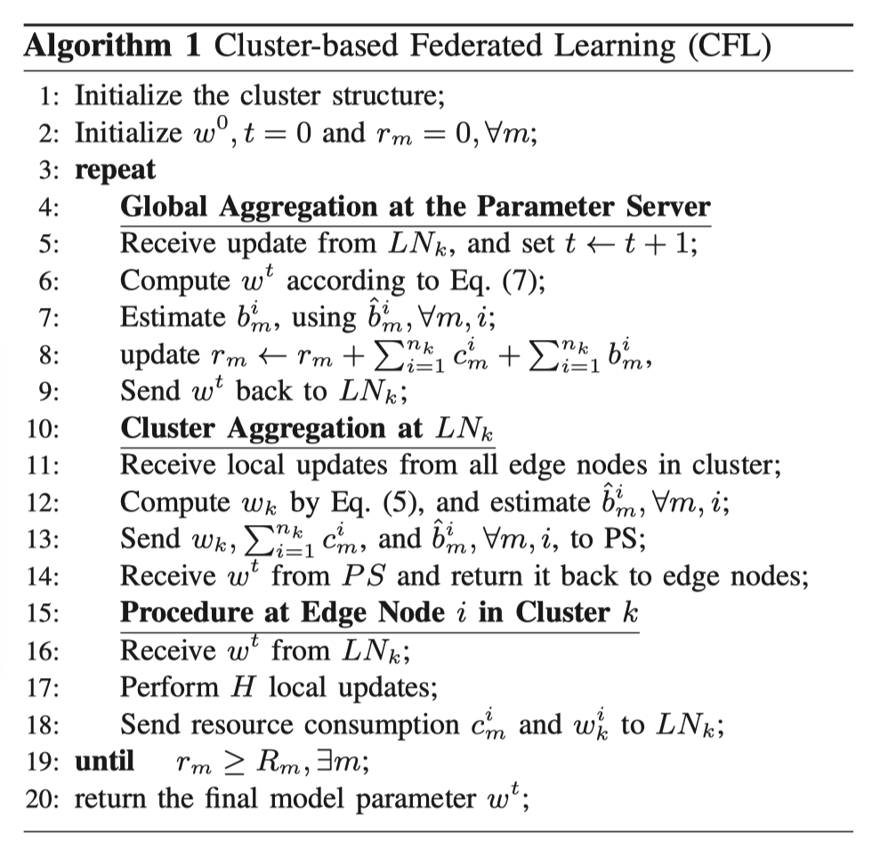

1、在初始化过程中，PS对所有边缘节点进行多个epoch的全局聚合，从边缘节点$i$收集$V_i$并估计参数（如$c_m$,$b_m$,$\mu$），然后搜索$K^*$，进行平衡聚类操作，选择各个$LN$。

2、PS主要实现两个功能(第5-9行)： PS从每个LN接收到局部模型后，更新全局模型，并返回更新后的模型；并且估计消耗资源，监视资源约束，当$r_m$超过了约束，则停止返回最终模型。

3、每个LN负责将集群聚合的结果转发到PS，并将更新后的模型返回到集群中的边缘节点。

4、边缘节点主要扮演局部模型训练器的角色。边缘节点接收到全局模型后，进行H次迭代，将结果转发给集群内的LN。

### C、拓展到动态场景

传统的CFL算法，每个边缘节点不会因电池耗尽、占用计算资源等突发事件而导致网络中断和训练能力下降。我们提出两种办法：一种是固定聚类，另一种是自适应聚类，可以作为CFL算法的补充。

- **固定簇**

在每个$T_b$次epoch之后，重新聚类，即PS内存在一个计数器$t_b$。但是重新聚类的过程中边缘节点$i$会停止训练，并将新的特征向量$V_i$转移到PS中，等待新的聚类结果。
$$
T_{b}=\varrho \cdot \mathcal{K}, \varrho \in N^{*}
$$
我们考虑$\varrho$如何确定，就必须考虑$K$，如果$K$小，说明每个集群中有更多的边缘节点。所以$\varrho$采用一个较小值。对于$K=1$和$K=N$我们令$\varrho$为$\infty$，因为这两种方法都不能实现重新聚类。然而，如何获得的最优值需要进一步的研究。

- **自适应聚类**

PS维护一个序列，$S=\{s_1,...s_K\}$表示每个簇的条件，$s_k=0$表示在集群$k$中没有掉队的节点。一旦$LN_k$发现掉队的节点（聚合时间明显增大），它设置$s_k=1$并且在下一次聚合时发给PS。设一个常数：
$$
\widetilde{\mathcal{K}} \in\{1, . ., \mathcal{K}\}
$$
如果PS检测满足：
$$
\sum_{k=1}^{\mathcal{K}} s_{k}=\widetilde{\mathcal{K}}
$$
则将触发重新聚类。即使LN在自适应重新聚类时死亡，无法进行聚类和将参数转发给PS，但可以正常触发固定的重新聚类，丢弃死亡节点，选择新的LNs进行后续训练。

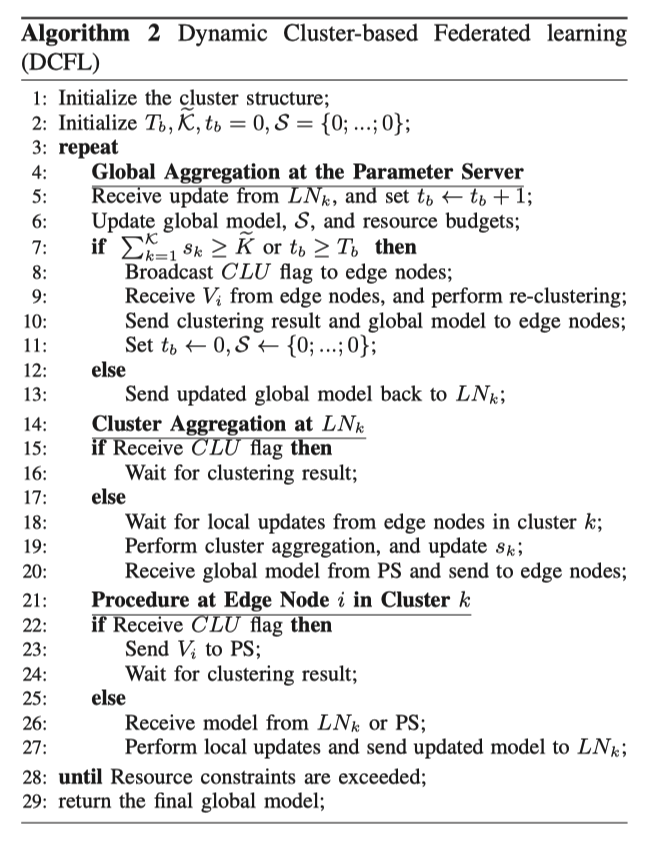

在算法2中为基于动态聚类的FL算法（DCFL），省略了算法1中的训练过程，只有当满足固定或者动态重构的条件时，进行重构（第7行），PS选择新的LN，当收到CLU标志后，将停止集群聚合，等待新的聚类结果下发。

---

## PERFORMANCE EVALUATION

### A、仿真设置

benchmark选择FedAsync和FedAvg，分别是异步和同步联邦学习。异步：当PS接收到任意边缘节点的一个模型时，就会对FedAsync进行全局更新。

训练模型采用SVM、LR、CNN在数据集MNIST和Cifar上进行训练。

性能指标：（1）损失函数；（2）分类精度；（3）训练消耗时间

资源消耗：为了量化通信成本，我们将LN与PS之间每个模型交换的成本称为1个单位。边缘节点与LN之间的通信为0.1个单位。原因如下：1.LN与PS之间的通信是集群内通信时间的10倍以上；2.长通信距离和频繁回程往往会导致网络拥塞。

数据分布：（1）将数据平均分配；（2）按照期望相同的高斯分布将数据分配到节点，但$\sigma$值不同。

仿真参数：学习率$\eta=0.01$，每个epoch局部更新次数为$H=10$，我们设置$a=5$和$b=1$来处理陈旧值。对于动态更新聚类算法，我们假设边缘节点有0.3的概率死亡，我们设置$\varrho=10$，$\widetilde{\mathcal{K}}=1$。

### B、仿真结果

**收敛性能**：CFL（10）比其他的好，CFL（20）与FedAvg相似

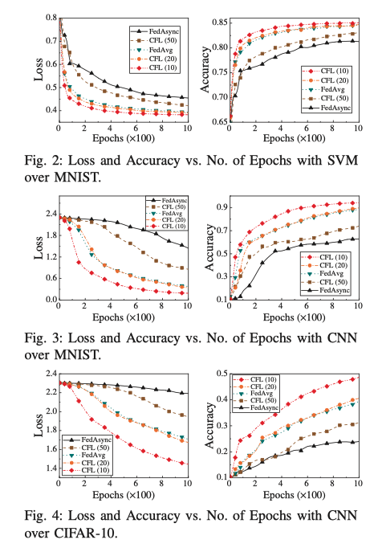

**资源约束**：我们采用了时间预算约束（例如，SVM/LR为600s, CNN超过MNIST为1800s）

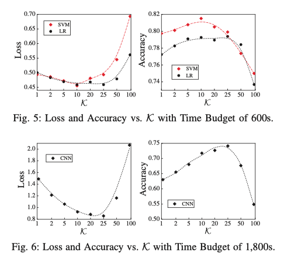

上图可知，对于不同的模型和数据集，K在10和25之间有不同的最优值。

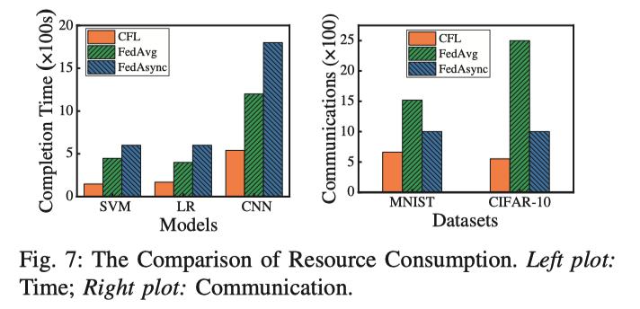

上图左图表示了不同模型算法的对比情况，右图展现了不同数据集上的测试情况。

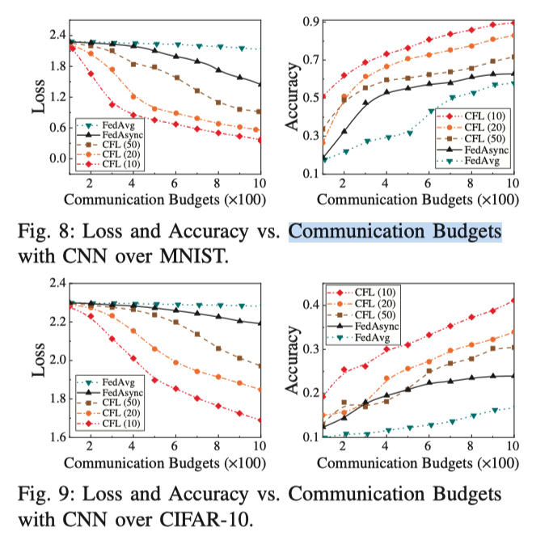

说明CFL节省了预算，使在相同预算情况下通信次数增加。

**数据分布**：不同算法的情况如下图所示，随着数据不平衡程度的增加，其他2中算法时间增加，但CFL增长较少。这可能是由于聚类的积极作用，避免了单边节点(FedAsync)的不利影响，并避免了每个epoch都等待所有边节点(FedAvg)的情况。

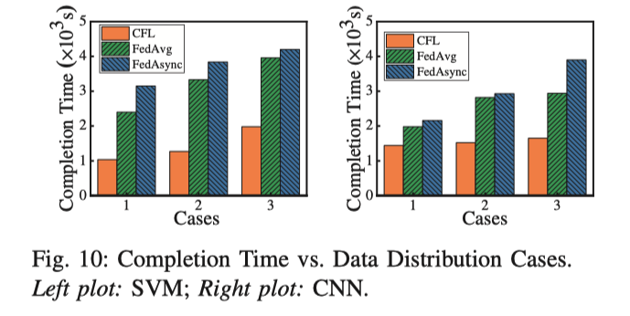

**动态场景**：假设有0.3的可能性节点会出现故障，FedAvg结束的很快（在100处准确率不再上升），因为有节点故障算法便会停止。CFL也会停止（epoch700左右），因为节点故障相应的集群会停止工作。

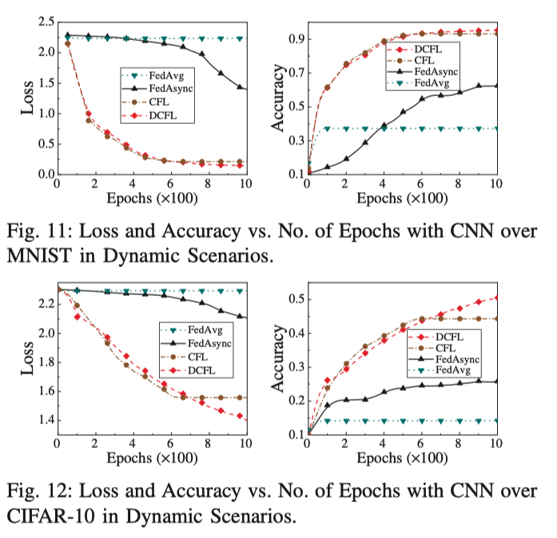

**陈旧度参数**：采用a（5，10，20）和b（0.5，1，2）进行训练，a=1000表示最后结束也没有采取陈旧度更新。可以看到a,b不同值对准确率影响并不大。

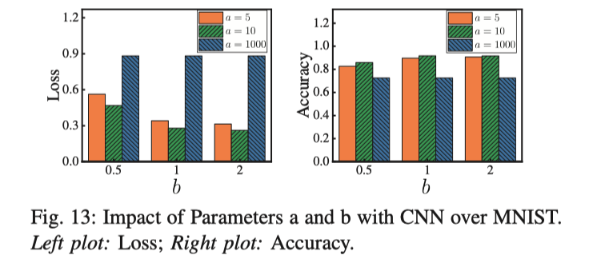

综上所述，在训练过程中，CFL在不同模型上的收敛性都优于基准。CFL在达到相似精度的同时，能够减小资源损耗。CFL可以有效处理数据不平衡。我们意识到DCFL能够很好地处理节点故障并维护训练过程。经过陈旧处理的CFL比未经过陈旧处理的算法分类准确率提高了26%。